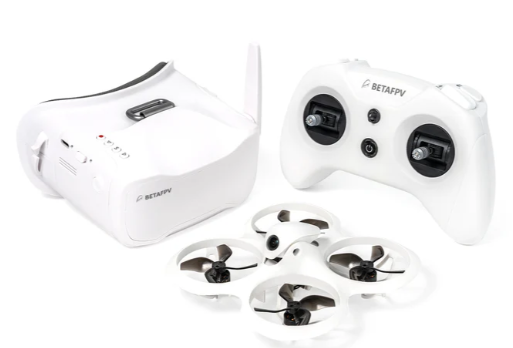

# Cetus X

## Описание
[Обзор FPV Cetus X Betaflight | BetaFPV | Первый дрон, старт в FPV. YouTube: Horizon](https://www.youtube.com/watch?v=MjO-WXwTGzM)

Достаточно часто новички этот дрон берут в комплекте [Cetus X FPV Kit](https://betafpv.com/collections/all-drone/products/cetus-x-fpv-kit)  
  
В него входят:  
- [дрон Cetus X](https://betafpv.com/collections/cetus-series/products/cetus-x-brushless-quadcopter)  
- [шлем VR03 FPV Goggles](https://betafpv.com/products/vr03-fpv-goggles)  
- [пульт LiteRadio 3](https://betafpv.com/collections/tx/products/literadio-3-radio-transmitter)

Преимуществом является тот факт что дрон, шлем и пульт уже сконфигурированы и связаны между собой. Это уменьшает порог вхождения в FPV хобби.  

Однако у данного комплекта есть свои недостатки.
1. Дрон имеет тяжелую и хрупкую раму. 
2. Закрытая форма канопы снижает вентиляцию VTX. 
3. VTX часто перегорает. А замена усложняется тем, что это единый [модуль С04, спаянных вместе камеры и VTX](./../90_Компоненты/Camera_VTX_C04.md). Подробности ниже.
4. У многих имеются нарекания к качеству и надежности "пластилиновых" моторов.
5. На пульте LiteRadio стоят потенциометры (а не датчики Холла). Из за этого достаточно быстро появляется дребезг в стиках. Приходится или смазывать, или менять на купленные отдельно стики с датчиками Холла. Подробности про пульт и его особенности [написано здесь](./../../../../10_Аппаратура(Пульты)/90_Модели/30_Betafpv/LiteRadio/01_Общая_информация.md)  

**!!! Категорически не рекомендуется** брать версию `Cetus FC`с приемником FrSky. В ней на полетнике имеются оптические датчики, которые якобы облегчают полеты для детей и новичков в режиме стабилизации. Однако в связи с этим у полетника своя прошивка от BETAFPV. Она очень ограничена по своим возможностям, несовместима с прошивкой Betaflight и требует собственного конфигуратора [BETAFPV_Configurator](https://github.com/BETAFPV/BETAFPV_Configurator).

## Советы новичкам
1. Общая рекомендация: прежде чем начать летать на дроне, отлетать хотя бы часов 10 в симуляторе.
2. Если включать дрон и не летать (например для настройки в конфигураторе), обязательно нужно обеспечить его вентиляцию. Иначе VTX сгорит еще до того, как будет осуществлен первый полет. В качестве альтернативы можно через OSD меню переводить VTX в PIT mode. Или настроить в Betaflight на кнопку на пульте переключение мощности.  
Подробности в видео от Петра:  
 [Cetus X - перегрев видео передатчика - часть 1. Отчего перегрев и как исправить.](https://www.youtube.com/watch?v=T5I1-_kiTXA)
 [FPV как переключать канал или мощность vtx с пульта](https://www.youtube.com/watch?v=ElDQzcKTmy0)  
3. Пересмотреть по возможности [Плейлист от Petrokey с набором видео по Cetus X](https://www.youtube.com/watch?v=tGPvwgN4XSA&list=PLibQsrRt3X1cWiIiE2T3RKKdAgSZxIGjX)  

## Отдельные видео

[Betafpv Cetus X - угомонись! Дрон прыгает, дрейфует и прилипает к стенам. Настройка FPV для квартиры. YouTube: Petrokey](https://www.youtube.com/watch?v=kPr2hmY9g5g)  
В этом видео:  
- почему так сложно летать дома на Cetus X?
- настройка angle, acro, профайлы
- трим горизонта
- прилипание к стенам и air mode
- прыганье на полу 

[BetafpvCetus X - перегрев видео передатчика - часть 1. Отчего перегрев и как исправить. YouTube Petrokey](https://www.youtube.com/watch?v=T5I1-_kiTXA)  
[Betafpv Cetus X - перегрев видео передатчика - часть 2. Таблица мощностей. Добавил 200мВт. YouTube Petrokey](https://www.youtube.com/watch?v=hDFj-GG1LZ8)
[FPV как переключать канал или мощность vtx с пульта. YouTube Petrokey](https://www.youtube.com/watch?v=ElDQzcKTmy0)  

