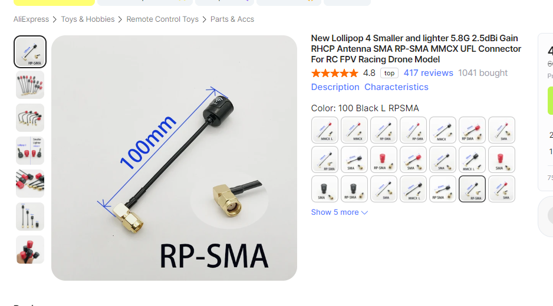
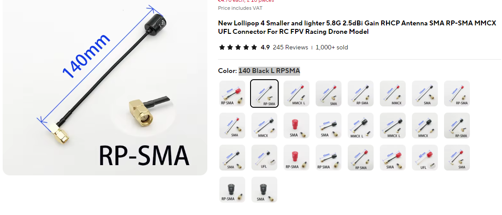
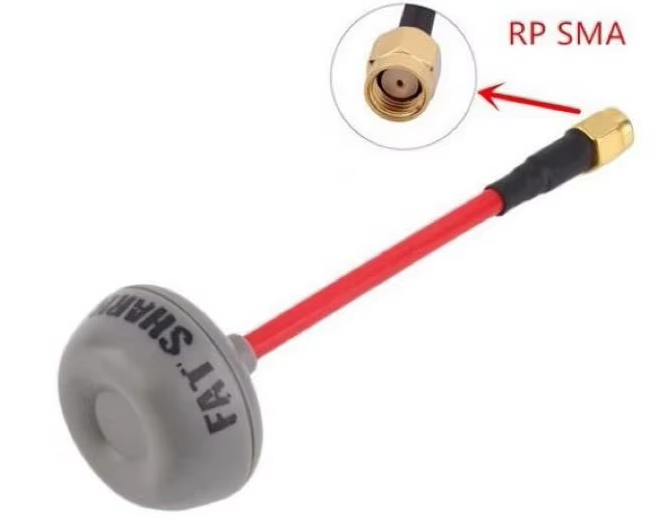

# Замена штатных антенн на дроне и шлеме

## Вариант 1
Подробности в видео от Петра:  
[Betafpv Cetus X - замена антенны. Lumenier Micro AXII 2 и Lollipop 4 на аналоговый FPV тайнивуп](https://www.youtube.com/watch?v=G2w1dMCCnoc)  

[Или в этом видео с 22;00. YouTube: Horizon](https://youtu.be/MjO-WXwTGzM?si=I5wlKjKbi_qzUL37&t=1320)

### На дрон:  
[Lumenier Micro AXII 2 Antenna 5.8GHz](https://www.aliexpress.com/item/1005006729452572.html). Брать нужно `RHCP 65mm`.  

### На шлем
[Lollipop 4 Smaller and lighter 5.8G 2.5dBi Gain RHCP](https://www.aliexpress.com/item/1005003744368958.html). Брать нужно `100mm, L RPSMA`, цвет на выбор.  

## Вариант 2

Проверенные антенны та Cetus X. Встает без танцев с бубном , играми с конфигураторам и переходниками. С заменой антенны, качество сигнала и дальность полета увеличились.   

### На дрон:  
[mini RHCP 5.8G Lollipop 4 Antenna](https://www.aliexpress.com/item/4001364197035.html). Брать надо `RED UFl Normal`.  

### На шлем
[Lollipop 4 Smaller and lighter 5.8G 2.5dBi Gain RHCP](https://www.aliexpress.com/item/1005003744368958.html). Брать нужно `140 Black L RPSMA`, цвет на выбор.  

## Еще одна антенна на шлем Betafpv VR03
Fatshark ImmersionRC SpiroNet 5.8GHz Circular Polarized  
[aliexpress.ru](https://aliexpress.ru/item/1005007576203785.html?sku_id=12000041361234282)  
[aliexpress.com](https://aliexpress.com/item/1005007576203785.html?sku_id=12000041361234282)  
  
Отзыв: прошла испытание на шлеме Betafpv VR03.
Всё отлично. Антенна гнётся и можно направить вертикально вверх.   
Но в штатный кейс вместе с антенной шлем не лезет.   
  
