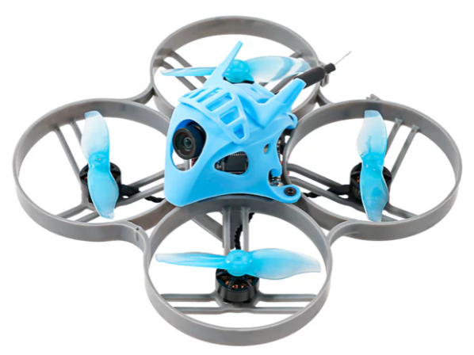

# Meteor85 (2022)
[Официальный сайт](https://betafpv.com/collections/meteor-series/products/meteor85-brushless-whoop-quadcopter-2022)  

 - Weight: 43.85g (without battery)
 - Flight Controller: [F4 1S 12A FC AIO](90_Компоненты/FC_F4_1S_12A_AIO.md)
 - Motors: [1103 11000KV with connector
](https://betafpv.com/collections/motors/products/1103-brushless-motors?variant=14762596007980)
 - Props: [Gemfan 2015 2-Blade Propellers](https://betafpv.com/products/gemfan-2015-2-blade-propellers-4pcs-1-5mm-shaft)
 - Camera: [Caddx C03 ](90_Компоненты/Camera_C03)
 - VTX: [M03 25-350mW](90_Компоненты/VTX_V03.md)
 - Frame: [Meteor85 Brushless Whoop Frame](https://betafpv.com/products/meteor85-brushless-whoop-frame)
 - Canopy: [Micro Canopy for HD Camera](https://betafpv.com/collections/canopy-holder/products/micro-canopy-for-hd-camera)
 - Receiver Option: ELRS 2.4G, SPI Frsky
 - Battery: [LAVA 2S 450mAh 75C Battery](https://betafpv.com/products/lava-2s-3s-4s-450mah-75c-battery-2pcs)
