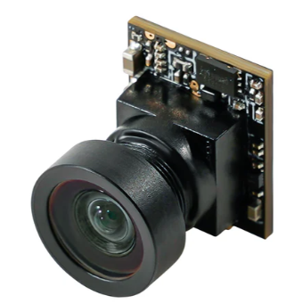
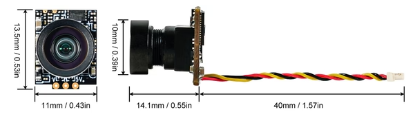

# Camera: [Caddx C03 ](https://betafpv.com/products/c03-fpv-micro-camera)

Specification
 - Image Sensor: 1/3" CMOS Sensor
 - Horizontal: 1200TVL with Global WDR
 - Signal System: NTSC (4:3)
 - Lens : 2.1mm(M7) FOV 160°
 - Dimension: 11*14.1*13.5mm
 - Net weight: 1.45g
 
