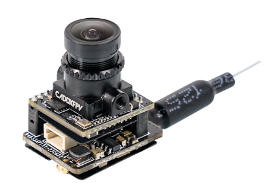
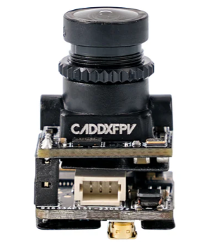

# Камера и VTX C04 (так называемый "бутрерброд")
Устанавливается преймущественно на Cetus X.   
Состоит из спаянных вместе камеры `Caddx Ant 4:3` и VTX.  
  
[Страница модуля на сайте производителя](https://betafpv.com/products/c04-camera-and-vtx-module)  

Если камера или VTX вышли из строя, при определенных навыках их можно разъединить и спасти уцелевший элемент.  

!! Обратите внимание, что у модулей разные коннекторы для разных контроллеров:  
 - M04 для Betaflight FC с встроенным ELRS  
  
 
 - M04 для Cetus FC с встроенным FrSky  

