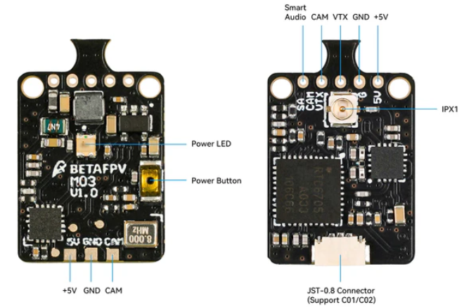
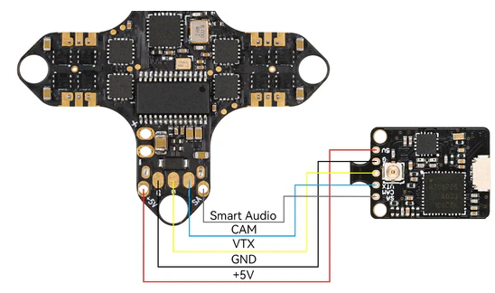
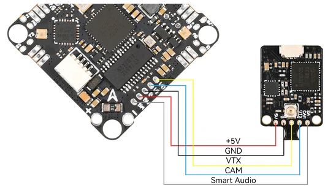

# VTX: [M03 25-350mW](https://betafpv.com/products/m03-25-350mw-5-8g-vtx?variant=39560808005766)

## Connect with [F4 1S 5A FC (ELRS 2.4G)](https://betafpv.com/products/f4-1s-5a-aio-brushless-flight-controller-elrs-2-4g)

## Connect with [F4 1S 12A FC (ELRS 2.4G)](https://betafpv.com/products/f4-1s-5a-aio-brushless-flight-controller-elrs-2-4g)

