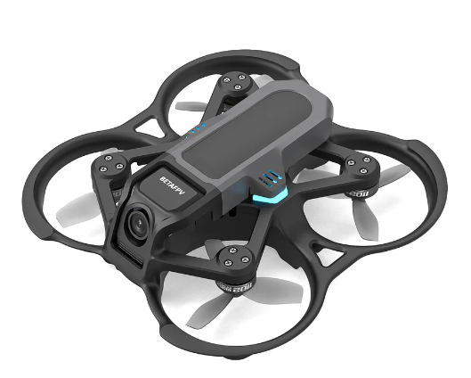

# BETAFPV Aquila16

[На сайте производителя](https://betafpv.com/products/aquila16-fpv-kit)  

[Betafpv Aquila16 - обзор, разбор, тест и сравнение с Cetus X. YouTube: Petrokey](https://www.youtube.com/watch?v=6h9S6akSipU)  
[Проблема с Betafpv Aquila. LiteRadio2se не работает с компом и симулятором. YouTube: Petrokey](https://www.youtube.com/watch?v=1lq6xgl1Efk)  

## Мнение пользователя @three_sss
Всем привет. Aquila16, мой первый дрон. Отзыв о самом дроне, опыт использования и доработки по замене камеры. Может кому будет полезно.

Комплект взял за 20 тыс.(дрон + 2 акб допом). Зарядное устройство WhoopStor VЗ 3 тыс. Конекторы 650, так как в комплекте только два провода для зарядки(спаял сам), но потом можно было заказать готовые провода (около 1.2 тыс).

Выбирал между Cetus и Aquila16. Cetus на тот момент,  был дороже на пару тысяч, но взял новинку. Больше понравился внешний вид и большее время полёта, около 8 минут, плюс режимы для новичка (до этого летал на китайском дроне с автомат режимами). ELRS 3.0.

Плюсы для меня:
- ценник адекватный, чтоб понять надо оно тебе или нет
- режим авто, где дрон зависает,  режим где управляешь сам газом,  ну и акро
- работает с симуляторами (есть особенности при подключении к Amd процессорам)
- стильный вид
- возможность докупить АКБ меньшей емкости (полегче) для трюков 
- стойкая к ударам рама
- возможность записать видео 
- защита пропов, не страшно о стены биться 
- режим черепахи 
- удобно менять каналы

Минусы:
- нет полноценного конфигуратора (через родной минимальные настройки)
- аппаратура глючила, стик Yaw. Жмёшь,  реакции ноль, потом резкий поворот. Решил смазкой потенциометра, проблема ушла, либо перед полетом надо было резко подергать стик
- аппаратура была не откалибрована, проверил в конфигураторе. Сделал калибровку
- антенна камеры внутренняя проволочка, нет ufl разъема. Разъём допом запаял.
- камера...для полётов в помещении супер, на улице ужас, темнота очень все плохо видно. Ставил кусок бумажки над камерой, чтоб засветов было меньше, плюс настраивал картинку в самих очках,  стало лучше летать,  видно более менее. Но деталей сама камера не выдаёт. По итогу, решил заменить камеру на baby ratel 2
- вибрация в полетах при резких маневрах. Нашел рекомендацию в комментах ютуба, снизить D составляющую в pid настройках на 10,20,30%. Снизил на 20, стало прям значительно лучше, но совсем не пропало, можно еще попробовать снизить, потестировать,  но пока и так вроде норм
- Дизарм в полетах. Ловил, очень редко. Поставил последние прошивки на пульт и дрон. Стало реже проявляться. В основном появлялось, когда летаешь на режиме Normal, где все авто. Либо Sport и скорости ниже Fast. В акро и S на макс скорости ни разу такого не было
- периодически пропадало видео, при падении отходил разъём камеры. Герметик решил проблему 

В целом меня все устраивает. Как вариант, купить, научиться летать, продать в полном комплекте и искать что-то уже посерьезней. Но мне было интересно его доработать, менять пока не планирую, для моих целей полетать хватает. 

### Про камеру, ufl и антенны

Есть видос как заменить камеру на ютубе. Там на Ant меняли, она по размерам компактнее и проще входит в канопу
Решил поставить baby ratel 2. Так как ее хвалили больше и в том же видео рекомендовали. Входит там все плотно на грани, подпилил упоры в канопе, встало все в штатные места. Бутерброд с vtx одну сторону выпаял, вторую спилил. Можно оба конца отпаять.
Обрезал провод, тот что в комплекте с камерой шел. Запаял в торчащие концы vtx. Там всего три провода. Как вариант, можно было взять отдельно vtx и новую камеру. Но так как всего три провода, возможно с osd были бы проблемы.  Не стал заморачиваться. Допом на vtx поставил медный радиатор, потом его еще допиливал, чтоб нормально влез.
Камера конечно небо и земля, словно прозрел от слепоты. В настройках камеры выбрал формат 4:3, и видео с Pal сменил на Ntsc. Osd стало норм показывать, а то до этого все вверх съехало

Проводок антенны выпаял, ufl запаял, но он такой маленький что это прям ювелирная работа и тонкое жало нужно. Антенну взял от новой мобулы, типо облегчённая. Можно наверх вывести,  но там помех много, стал сбоку крепить, через хомут

Заказал еще антенки круговой поляризации на дрон и коптер, потестирую.
foxeer Micro Lollipop на дрон и Rush Cherry II на очки

Всем спасибо, кто дочитал и всех благ ✊