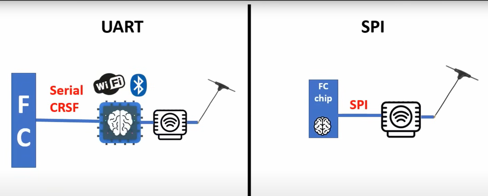

# Общая информация
ExpressLRS (ELRS) — ExpressLRS является современной радиоуправляемой системой обеспечивающий передачу сигнала с пульта на приемник для управления дроном. В ней доступны все возможности, которые необходимы для операторов FPV. Более высокая частота обновления. 

Предыстория: фирма [Team Blaсk Sheep](https://www.team-blacksheep.com/) разработала систему радиосвязи TBS Crossfire Tx, где название протокола связи - Crossfire.   
Open Source сообщество разработало свою систему радио связи ExpressLRS. Протокол связи тот же Crossfire, но обвязка другая.

[ExpressLRS - взгляд изнутри. Принципы, алгоритмы, форматы... Youtube: Petrokey](https://www.youtube.com/watch?v=WoXPkvHTBi4)  

[Всё про ELRS (dzen.ru)](https://dzen.ru/a/ZiC61ueuLzUoSm3_)  

[Before First Flight](https://www.expresslrs.org/quick-start/pre-1stflight/)  

[ELRS dipole antenna orientation - horizontal or vertical](https://intofpv.com/t-elrs-dipole-antenna-orientation-horizontal-or-vertical)

## Отличия подключения через UART и  SPI
Картинка взята из видео Петрокея [ExpressLRS - взгляд изнутри. Принципы, алгоритмы, форматы... Youtube: Petrokey](https://www.youtube.com/watch?v=WoXPkvHTBi4)   

## Прошивка ELRS приемников, подключенных по SPI
На вупах часто стоят полётники с SPI приёмниками. Их не нужно отдельно прошивать, их прошивка уже содержится в Betaflight.

Betaflight 4.3.x идет с ELRS 2.x.x  
Betaflight 4.4.x идет с ELRS 3.x.x  

Также раньше были сборки Betaflight 4.3 с поддержкой ELRS 3, но с выпуском Betaflight 4.4 необходимость в них отпала, ставьте официальный 4.4.

[Взято отсюда](https://www.expresslrs.org/hardware/spi-receivers/).

Не забывайте, что при апгрейде с 4.3 на 4.4 слетают настройки, перед обновлением делайте бекап с помощью cli (diff all) или с помощью кнопки Save backup на вкладке "Presets". Тюнинг от 4.3 подходит к 4.4.

