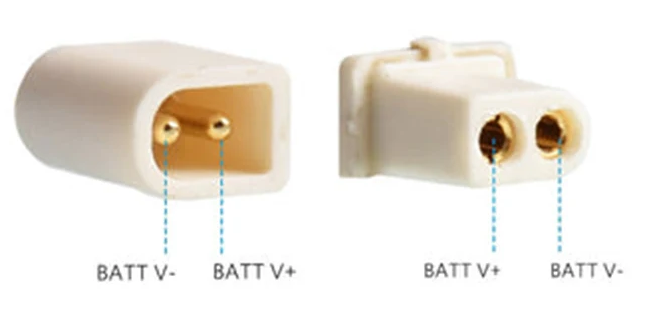
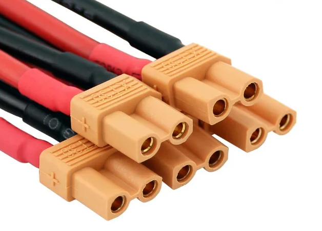
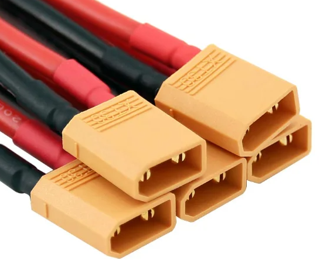
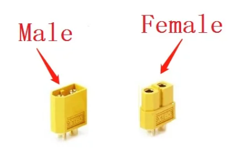
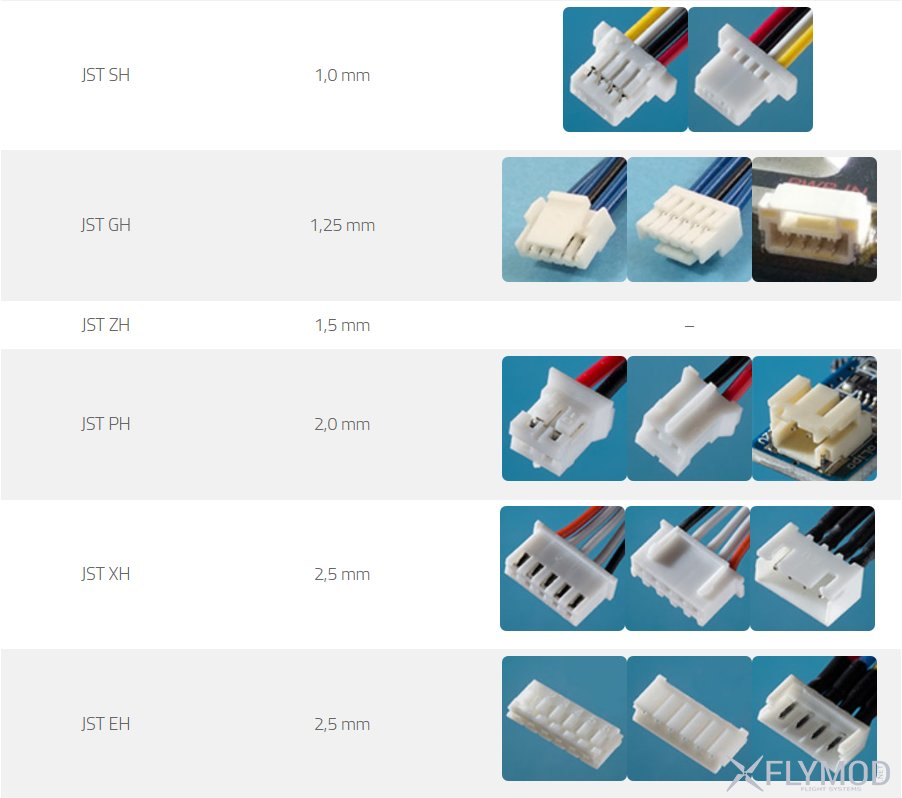
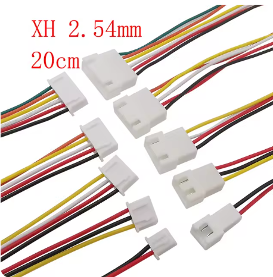
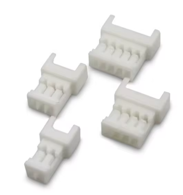
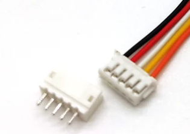

# [FAQ по силовым и сигнальным коннекторам для начинающих](https://flymod.net/txt/power_connector_faq) 

# Силовые коннекторы

## BT2.0
На 1S батареях для вупов от BETAFPV и Happymodel чаще всего используется коннектор BT2.0  
 

[Коннектор на AliExpress.com](https://aliexpress.com/item/1005004465425088.html)  
[Коннектор с кабелем](https://aliexpress.com/item/1005004332146747.html)

##  XT30, XT60, XT90
На 2-6S батареях часто используется коннекторы XT30, XT60, XT90. Выглядят похоже, только отличаются размером. 30, 60, 90 означает максимальный ток. Соответвенно, чем току выше, тем коннектор больше и имеет более толстые контакты.
  
  
 

[Коннекторы XT30, XT60 Male/Female на AliExpress.com](https://aliexpress.com/item/33061763696.html)  
[Конектор XT30 Male/Female с проводом](https://aliexpress.com/item/4000508049106.html)  
[Конектор XT60 Male/Female с проводом](https://https://aliexpress.com/item/4000303272962.html?)  
[Переходник XT30 Male to XT60 Female](https://aliexpress.com/item/1005006329573000.html)  
[Переходник из автомобильного прикуривателя в XT60(14awg Amass)](https://aliexpress.com/item/4000545689742.html)  

# Сигнальные коннекторы

## JST XH 2.54mm Connector
Используются в качестве балансировочных коннекторов для аккумуляторов 2-6S. Рассчитаны на ток в 3А и напряжение 250V.  
[Aliexpress.com](https://aliexpress.com/item/1005004942868032.html)
  

## Micro JST 1.25mm
Предназначены для подключения к портам современных контроллеров.  
[Aliexpress.com](https://aliexpress.com/item/1005003998299082.html)
  

## SH 1.0mm
Предназначены для подключения к портам современных контроллеров и остальных маломощных модулей.  
[Aliexpress.com](https://aliexpress.com/item/4000898605030.html)  

