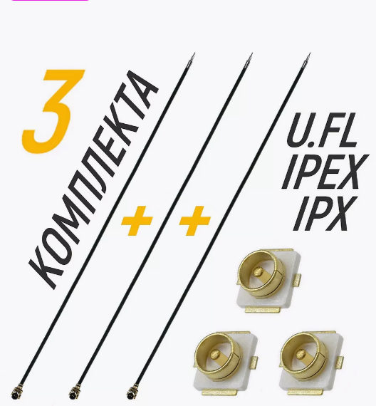

# Общая информация

## Полезная информация

[Канали, Бенди, Частоти VTX. . YouTube: Жвавий Дрон](https://www.youtube.com/watch?v=1WV-2_DJHRE)  

[FPV Frequency Reference Chart](https://www.getfpv.com/learn/fpv-essentials/fpv-frequency-reference-chart/)

[Betafpv Cetus X - перегрев видео передатчика - часть 1. Отчего перегрев и как исправить. YouTube Petrokey](https://www.youtube.com/watch?v=T5I1-_kiTXA)  
[Betafpv Cetus X - перегрев видео передатчика - часть 2. Таблица мощностей. Добавил 200мВт. YouTube Petrokey](https://www.youtube.com/watch?v=hDFj-GG1LZ8)

[BETAFLIGHT 4.3+. Изменение мощности VTX тумблером с аппаратуры. Smartaudio/Tramp. YouTube: SetUP](https://www.youtube.com/watch?v=ocmA_Z_sSA0)

[как переключать канал или мощность vtx с пульта – betafpv Cetus X, LiteRadio3, Radiomaster tx16s. YouTube Petrokey](https://www.youtube.com/watch?v=ElDQzcKTmy0)

## Оторвался разъем антенны
Отпаиваешь феном остатки от пятака `UFL`, зачищаешь центральную жилу и два отвода экрана аккуратно припаиваешь, потом заливает все клеем b7000 или Т8000.   
Советую заказать разъемы на озоне и вайлберис и перепаять как должно быть.
[Коаксиальный кабель IPEX/IPX + Разъем UFL U.FL-R-SMT ](https://www.wildberries.ru/catalog/89028880/detail.aspx)  

