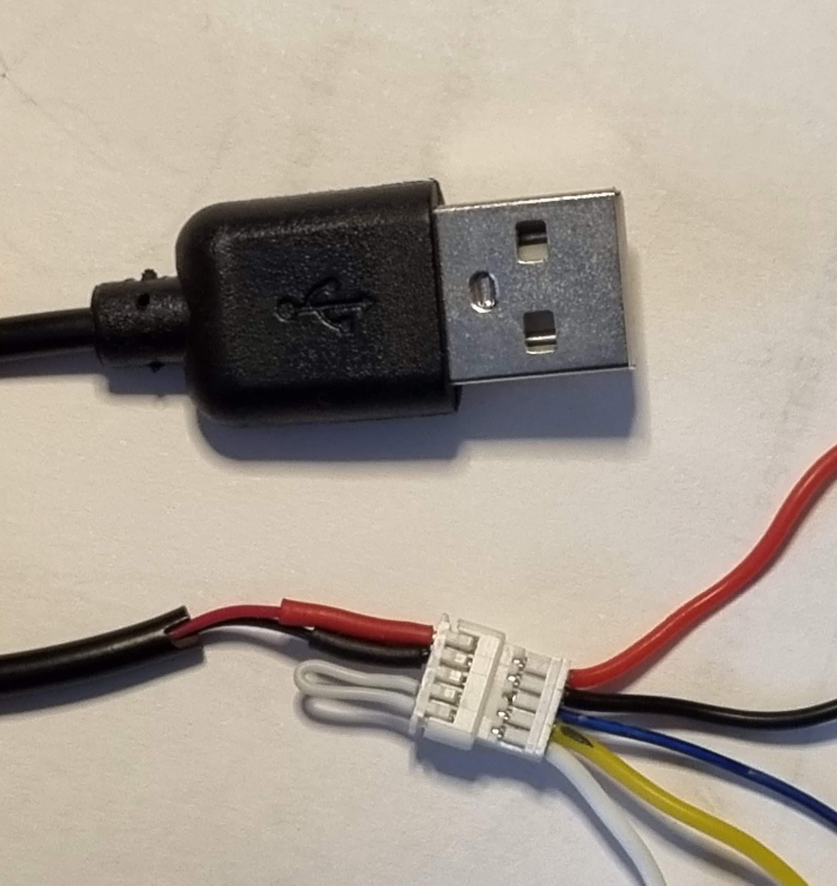
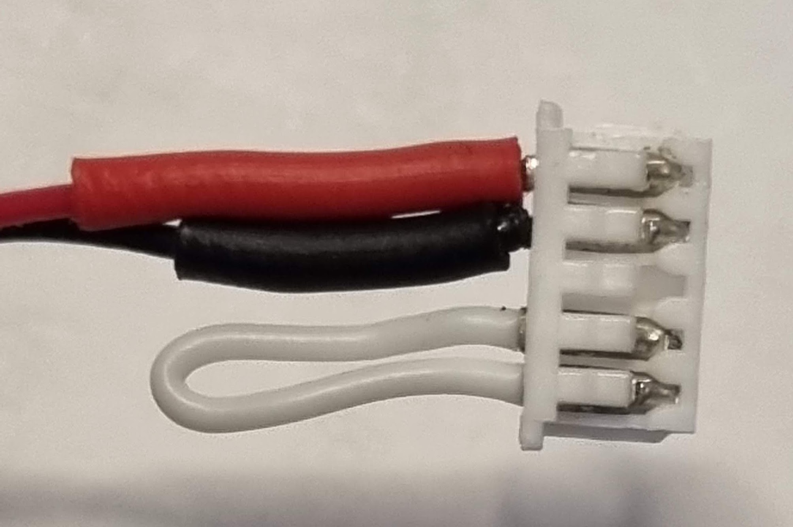

# Подключаем VTX к камере

1. Берем кабель USB Type A, отрезаем, чтобы получить доступ к проводам +5v и земля
2. На VTX подаем +5v и землю с кабеля
3. Видео-выход с камеры подаем на видеовход VTX, тем самым эмулируя, что полетник наложил OSD на видеосигнал и отдал его для передачи в эфир.

  

Подключаем питание. Делаем поиск частоты в шлеме или очках. Должен появиться чистый видеосигнал с камеры.