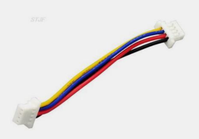

# Вопросы, проблемы и решения

## Почему моторы набирают обороты при арме? Почему при посадке дрон прыгает/скачет?
[YouTube: SetUP](https://www.youtube.com/watch?v=kuZ_bh9Yz9Y)

## При подаче высокого газа (около 80%) начинается тряска
 - cнять пропы, покрутить моторы под очереди в Betaflight - подглядеть данные акселерометра. Возможно, один из моторов кривой. 
 - поставить другие пропы.
 - дальше уже можно пробовать пиды крутить. Накинуть фильтров побольше, снизить D, и т.д.

## Как снять/надеть пропы пальцами на примере Meteor75
[Видео от Виталия (@V8787)](PropsInOut.mp4)
 
## Как надеть стопорное кольцо на моторе
Надавливаешь на колокол снизу, стопорное кольцо пинцетом насаживаешь в прорезь на валу, потом обратной стороной пинцета сразу же надавливаешь на кольцо и с характерным щелчком садиться обратно.

## Длина антенн
Для VTX на 5.8 ГГц: Длина антенны обычно составляет около 12.92 мм или половину этого значения (6.46 мм), что соответствует полной или половинной длине волны. 

Для ELRS на 2.4 ГГц: Длина антенны обычно составляет около 31.23 мм или половину этого значения (15.61 мм), что соответствует полной или половинной длине волны 

## Бинд есть, но в Betaflight ничего не шевелится:
1. Проверяем что приемник (если он внешний) соединен с полетником tx-rx/rx-tx, 
2. Проверяем порты подключения приемника и протокол в Betaflight.
3. Проверяем горит ли приемник или моргает 3 раза, если 2е то в Lua Script ELRS отключаем `ModelMatch` (поможет сделать ON потом OFF с сохранением).

## Мой приемник всегда светится зеленым и не биндится
Проблема бывает, если полетник от iFlight и при подключении приемника он всегда светится, не шьется, не поднимает WiFi.  
Решения:
1. Перенести приемник на UART1
2. Сделать подтяжку как на картинке (но проще перенести на 1й юарт)

[Отсюда](https://t.me/expresslrs_rus/66110)

## Дрон кувыркается при попытке взлететь 
Если квад армится, а при попытке лететь, кувыркается и дизармится, то надо проверить:  
1. Как себя моделька в Betaflight ведёт при наклонах/поворотах дрона, надо чтобы совпадало с тем что делаешь(иначе развернуть положение гиры в Betaflight) 
2. Совпадает мапинг моторов, т.е. что 1 мотор это задний правый и т.д.  
3. Совпадает направление вращения моторов  
4. Правильно установлены пропеллеры (не вверх ногами и не перепутаны левый правый)  
5. Стоит флажок props out, если это требуется на основе того как установлены пропы  

## Провод для коннекта дрона с компьютером через USB Type-C переходник
[JST1.0 SH1.0 4pin cable (AliExpress.ru)](https://aliexpress.ru/item/1005005796723171.html?sku_id=12000034384188766)  
[JST1.0 SH1.0 4pin cable (AliExpress.com)](https://aliexpress.com/item/1005005796723171.html?sku_id=12000034384188766)  
  
Только нужно будет ему порядок пинов поменять с одного конца.

## Дрон (полетный контроллер) не переходит в DFU
**Вопрос**: Подскажите почему дрон не переходит в DFU режим, хотел обновить прошивку, а бетка не прошивает, говорит устройство не найдено…

**Решение**
Запустить `Impulse RC Driver Fixing Tool`.  
Скачать можно [здесь](https://impulserc.blob.core.windows.net/utilities/ImpulseRC_Driver_Fixer.exe). Видео с объяснением: [Impulse RC Driver Fixing Tool (for flight controller USB connection problems)](https://www.youtube.com/watch?v=9yQYVfHgmD8).

**Еще варианты решения**
[Прошивка Betaflight 4.5 - нет DFU? YouTube: Petrokey](https://www.youtube.com/watch?v=0ig1Vrjek1U)

## Помехи в изображении шлема
**Вопрос**: В шлеме BETAFPV VR03 появляются помехи.  Записал DVR, а на нем идеальное изображение без помех.  
Связка: Foxeer f405, VTX Zeus nano. Отдельно VTX с камерой и другим полетником нормально работают. Как такое может быть?

**Решение**: Переключил камеру с PAL на NTSC и помехи ушли

## Что такое crash_recovery mode
Он запомнит положение дрона перед столкновением и попробует в заданных перделах вернуться к нему же. Когда выйдет в то же положение или поймёт что не может - вернёт управление пилоту.  
Подробное видео: [Winning Whoop racers use Betaflight crash_recovery. Should you?](https://www.youtube.com/watch?v=5YyxIft9wKM)