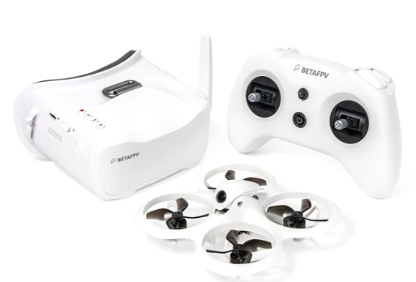

# Комплекты и варианты самосборов дронов

## Ready To Fly kit (RTF) наборы

[Cetus X FPV Kit](https://betafpv.com/collections/all-drone/products/cetus-x-fpv-kit)    
   
Почитать [можно здесь](./01_Модели/Betafpv/10_Cetus_X/10_Общее.md)

## Готовые дроны

### Для помещений (с дактами)
[BETAFPV Meteor65 Pro](./01_Модели/Betafpv/Meteor65_Pro.md)  
[BETAFPV Meteor Air65](./01_Модели/Betafpv/Meteor_Air65.md)  
[BETAFPV Meteor75 Pro](./01_Модели/Betafpv/Meteor75_Pro.md)  
[Happymodel Mobeetle6](./01_Модели/Happymodel/Mobeetle6.md)  

### Для улицы
[BETAFPV Meteor85 (2022) (с дактами)](./01_Модели/Betafpv/Meteor85.md)  
[HGLRC Draknight 2-inch toothpick (без дактов)](./01_Модели/HGLRC/Draknight_2-inch.md)  
[Darwin Baby Ape Pro V2 FPV Drone 3-inch (без дактов](./01_Модели/DarwinFPV/BabyApe_Pro_V2.md)

## Самосбор

### Для помещений

#### На базе Happymodel Mobula 6 
Дрон Mobula 6 2024 V2.0  
Полетный контролер SuperX V2.0  
Рама Mobula 6 2024 (черная)    
Подшипниковые моторы 0702 VCI 25 | 27 | 29 k kv ( комплект 4 мотора)  
Аккумулятор 1s DOGCOM 320    

#### На базе Meteor air65 
Рама BETAFPV 65 air  
Canopy BETAFPV meteor    
Полетный контроллер BETAFPV f4 aio  
VTX BETAFPV m03   
Камера C02 BetaFpv    
Моторы vci 0802 25000 kv   

### Для улицы

#### На базе BETAFPV Meteor85
[Рама от BETAFPV Meteor 85](https://betafpv.com/products/meteor85-brushless-whoop-frame?variant=40024037654662)  
[Моторы BETAFPV 1103 11000KV-2S](https://betafpv.com/collections/motors/products/1103-brushless-motors?variant=14762596007980)  
[Полетный контроллер BETAFPV F4 1S 12A AIO SPI ELRS 2.4G](https://betafpv.com/products/f4-1s-12a-flight-controller)  
[Камера Caddx Ratel 2 Baby](https://caddxfpv.com/products/caddxfpv-baby-ratel2-analog-camera)  
[Видеопередатчик RUSH TINY TANK Nano VTX](https://rushfpv.net/products/tank-tiny-vtx)  
[Пропеллеры Gemfan 2015 2-Blade Propellers 4PCS (1.5mm Shaft)](https://betafpv.com/products/gemfan-2015-2-blade-propellers-4pcs-1-5mm-shaft)  
[Батарея LAVA 2S3S4S 450mAh 75C](https://betafpv.com/products/lava-2s-3s-4s-450mah-75c-battery-2pcs)  

####  2,5" чертолет от @Тимура
Speedybee f405 mini(лучше aio взять, этот полетник вообще запаска для трешки и с этой рамой не очень совместим)  
моторы happymodel 1204 5000kv  
VTX zeus nano  
Камера caddx baby rattle 2  
Пропеллеры emax avan 2,5"(есть и на 2")   
Антенна rush cherry 2  
Приемник елрс 2,4 любой  
Рама eyas 100  
Кастомные подкладки под моторы, дабы их поднять над стаком  
Кастомная канопа 20х20, ибо с таким стаком туда вообще ничего другого либо не лезет

