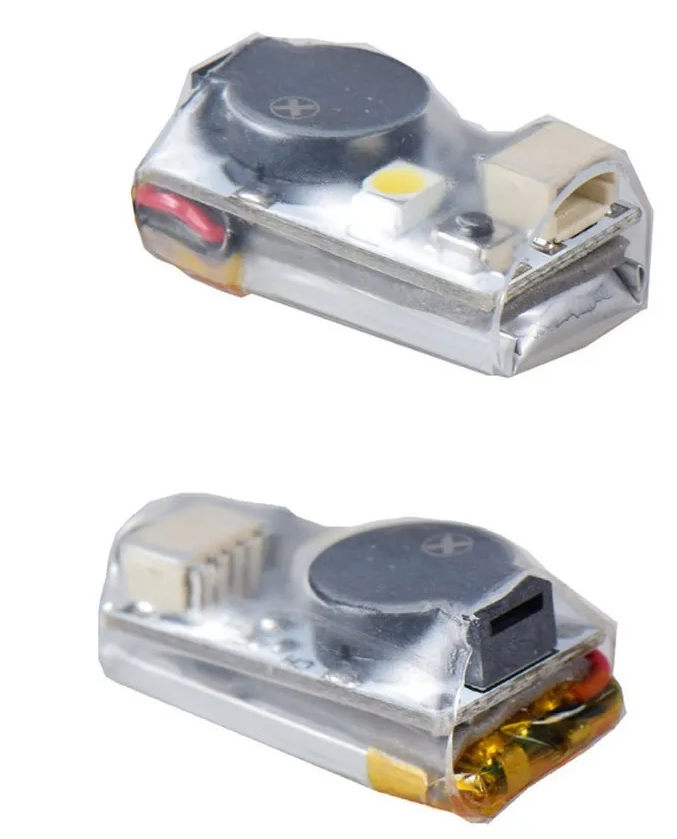

# Внешний бузер (buzzer, бипер, пищалка)

## VIFLY Beacon Wireless Drone Buzzer
[На Aliexpress.com](https://aliexpress.com/item/4000645203533.html)  
  
[Как не потерять дрон, или установка и тест Vifly beacon пищалки на Betafpv Cetus X FPV. YouTube: Petrokey](https://www.youtube.com/watch?v=jTDNMKAEFCI)  

Работой бузера доволен. 
Я прикрепил на боковой луч Cetus X. На балансировку не повлияло. Правда при падении вверх ногами погнул зарядный разъем на бузере. Поэтому стал вешать снизу. Там он более защищенный...  м
На Meteor85 тоже повесил под боковым лучом.

## JHE20B Mini Finder 5V 
[На Aliexpress.com](https://aliexpress.com/item/1005004901077071.html)  
  
[Cetus X Vifly Finder Mini installation - YouTube](https://www.youtube.com/shorts/3XbDSjdwDVc)  

### Подключение к Meteor75
[Подключить неподключаемое - vifly mini на meteor75 где нет контактов BUZ. YouTube: Petrokey](https://www.youtube.com/watch?v=JfopONCaKm4)    
На полетнике Meteor75 отсутствует пятка `buzz`.  
Поэтому можно запитать от контактов `LED`  
'+' на 5v  
'-' на gnd    
Зеленый на LED -  

Но при подключении питания она сразу пищит сплошным звуком, а при нажатии на соотв. клавишу пульта - прерывистым. Если отключаю ее мелкой кнопкой - просто замолкает насовсем, и не реагирует на пульт.  
Причина: На контакте линия (+), а ему нужен управляющий (-).  
Нужно инвертировать командой
```
set beeper_inversion = OFF
```
Подробности в видео [Лечение проблемы при подключении буззеров HE42B/ JHE42B _ s/JHE20B на дроны серии meteor 75 pro. YouTube: practic61](https://www.youtube.com/watch?v=kq6BvsVIpjo)

