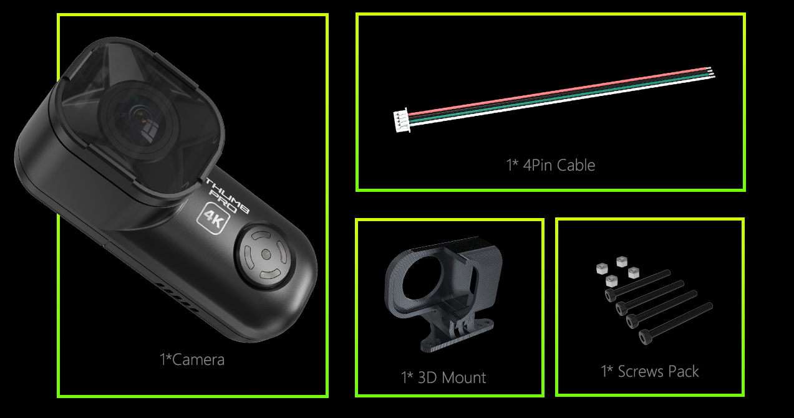
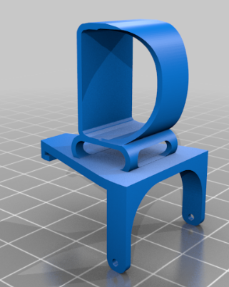
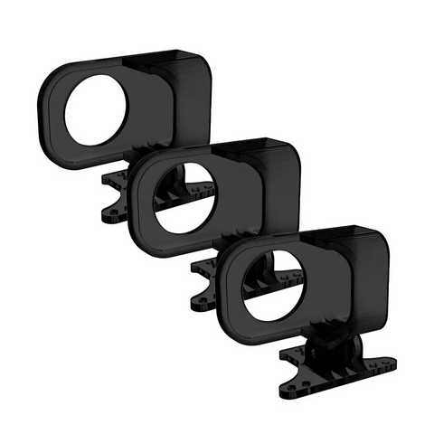

# Внешняя камера Runcam Thumb Pro 4k

[Описание на сайте производителя](https://shop.runcam.com/runcam-thumb-pro-w/)  
[AliExpress.com](https://vi.aliexpress.com/item/1005005073232838.html)

## Обзоры
[Обзор от Anik FPV](https://www.youtube.com/watch?v=144QICTrvas)  
[Runcam Thumb Pro на betafpv Cetus X – нюансы и проблемы подключения. YouTube Petrokey](https://www.youtube.com/watch?v=QPvnDKxcD2k)

[Convert your Cetus to a 4K Cinewhoop!. YouTube TRONCAT FPV](https://www.youtube.com/watch?v=ttPTg7Qtvcg)

## Крепления
[Cetus X - Runcam Thumb Pro Mount from Troncat_FPV](https://www.thingiverse.com/thing:5658784)  

[RunCam 3D Mount for Thumb Pro 3 PCS на AliExpress.com](https://vi.aliexpress.com/item/1005004716364902.html)  

## Стабилизация в Giroflow
[Gyroflow documentation](https://docs.gyroflow.xyz/app)  
[Как работает Gyroflow - подробная инструкция. YouTube Petrokey](https://www.youtube.com/watch?v=0rqx8EiBAkw)  
[Стабилизация RunCam Thumb в Gyroflow. YouTube 
Lesha Rodin](https://www.youtube.com/watch?v=ecghQCALSxM)
[Не падай в обморок от стабилизации! Релиз Gyroflow 1.0.0. YouTube Олег Стельмах](https://www.youtube.com/watch?v=HGvttNQavx4)