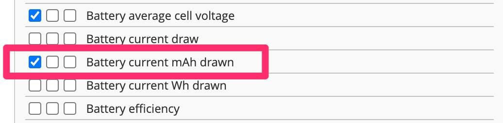

# Расход батареи

Дроны на прошивке Betaflight позволяют выводить в OSD расход батареи, что бывает удобно для понимания израсходованного количества и степени деградации емкости.  

Однако может потребоваться калибровка сенсора. Вот статья об этом:  
[Current Sensor Calibration in Betaflight](https://oscarliang.com/current-sensor-calibration/)

Ниже представлена таблица, показывающая критические значения уровней расхода батареи в зависимости от ее емкости.  

