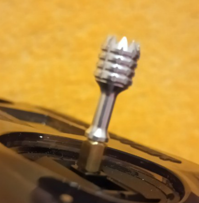

# Удлинение стиков
Латунная стойка для печатных плат М3 6 мм подходит по диаметру и резьбе для удлинения стиков.  

  
Это решение позволяет убирать стики в родное место при этом не откручивать стойки.