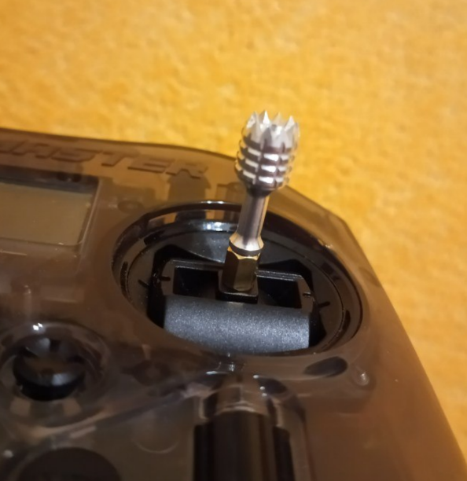
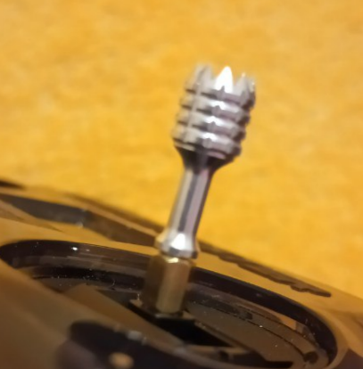
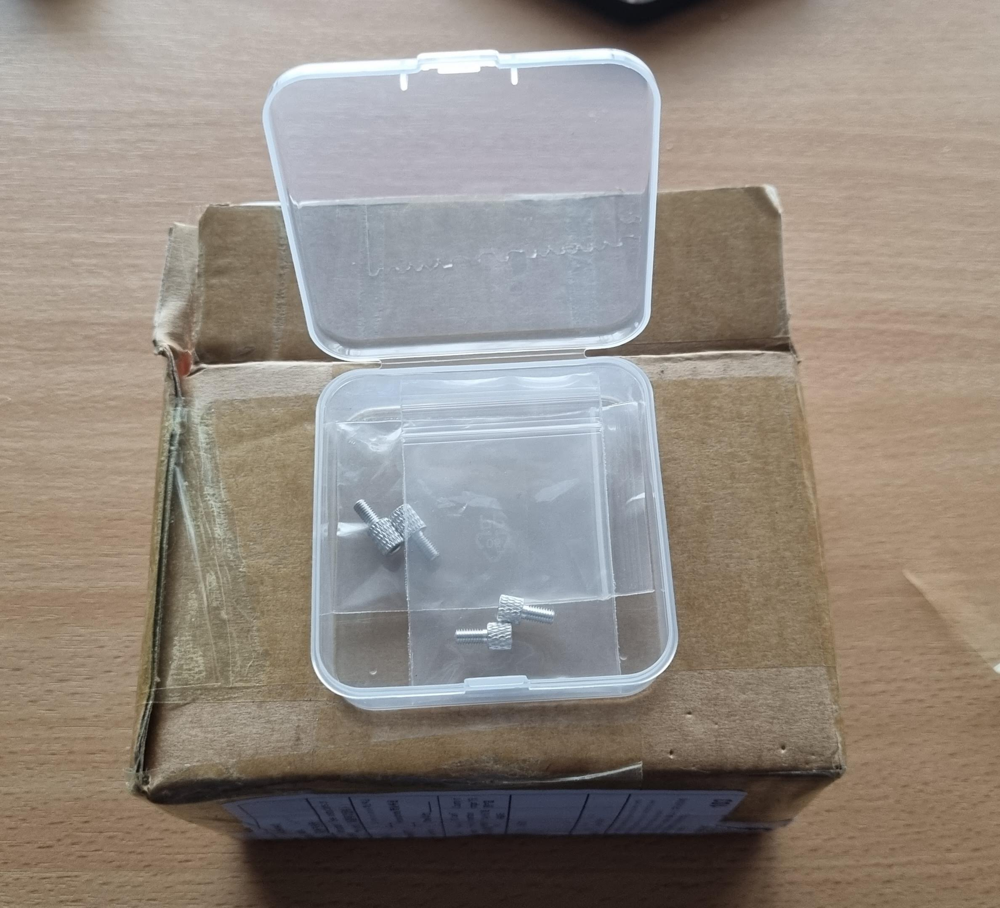
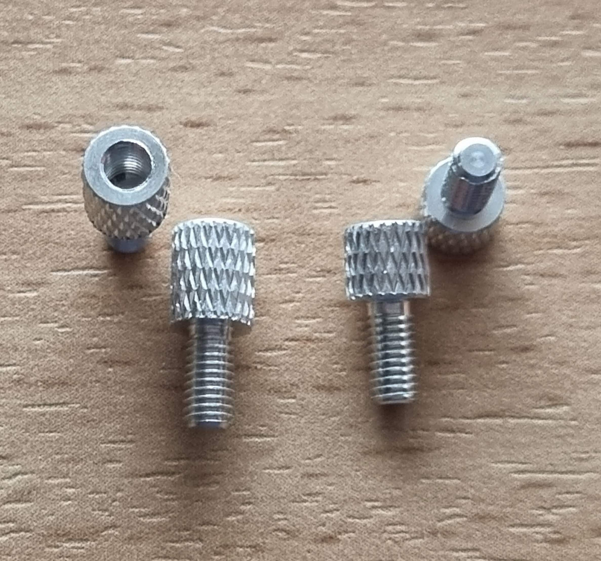
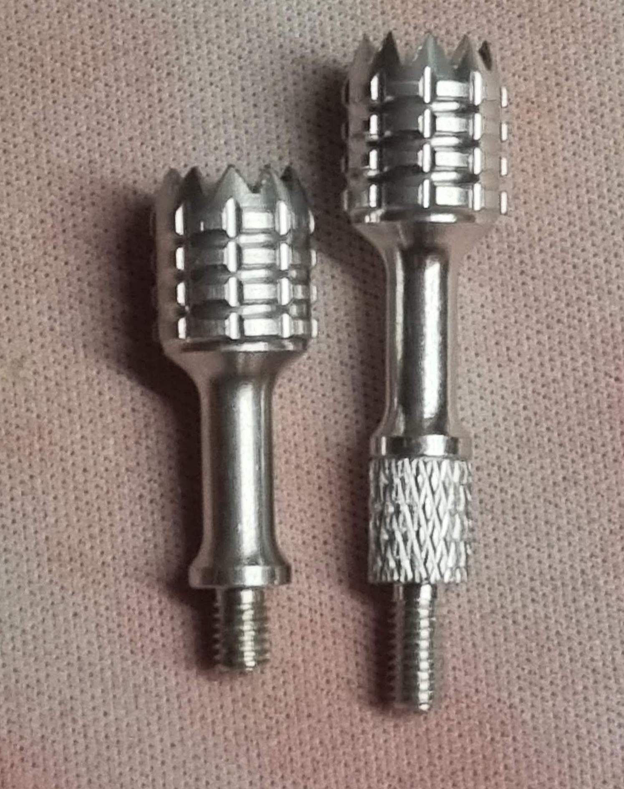
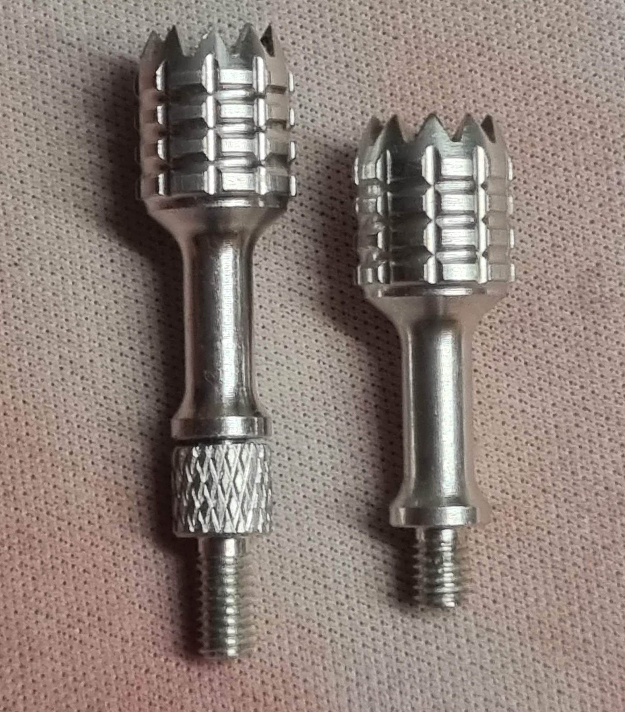
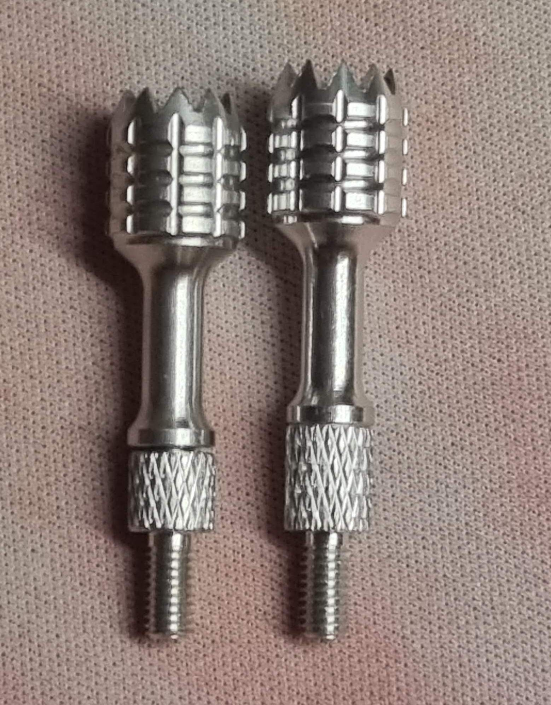
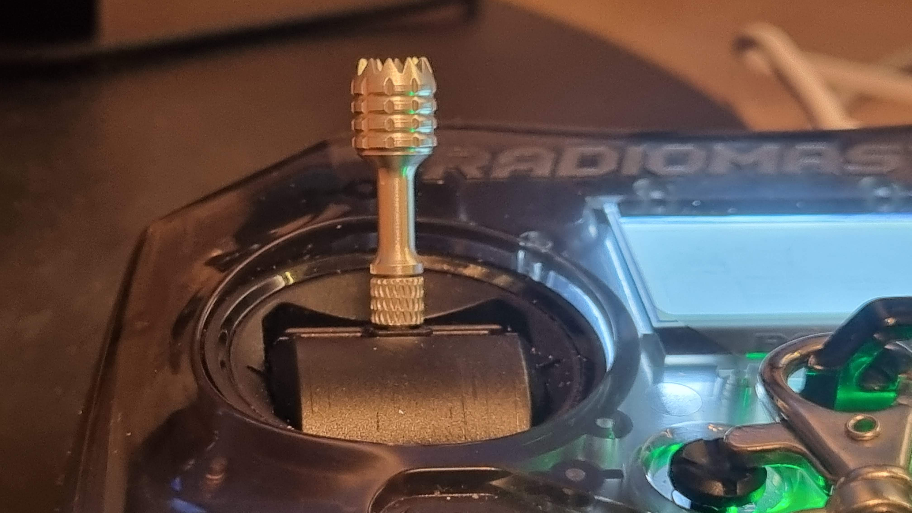

# Удлинение стиков

## Самодельное решение
Латунная стойка для печатных плат М3 6 мм подходит по диаметру и резьбе для удлинения стиков.  

  
Это решение позволяет убирать стики в родное место при этом не откручивать стойки.

## Фабричные удлинители
[Pocket Gimbal Stick Extender set](https://www.radiomasterrc.com/products/pocket-gimbal-stick-extender-set)  

В комплекте две пары удлинителей разной длины.  
Впечатления... непривычные. Конечно чувствительность лучше стала. Но нужно привыкать, приходится сильнее пальцами размахивать 😏

Упаковка   
  
Внешний вид
  
Сравнение с коротким удлинителем.   
  
Сравнение с длинным удлинителем.   
  
Сравнение с обоих удлинителей.   
  
Внешний вид
  

