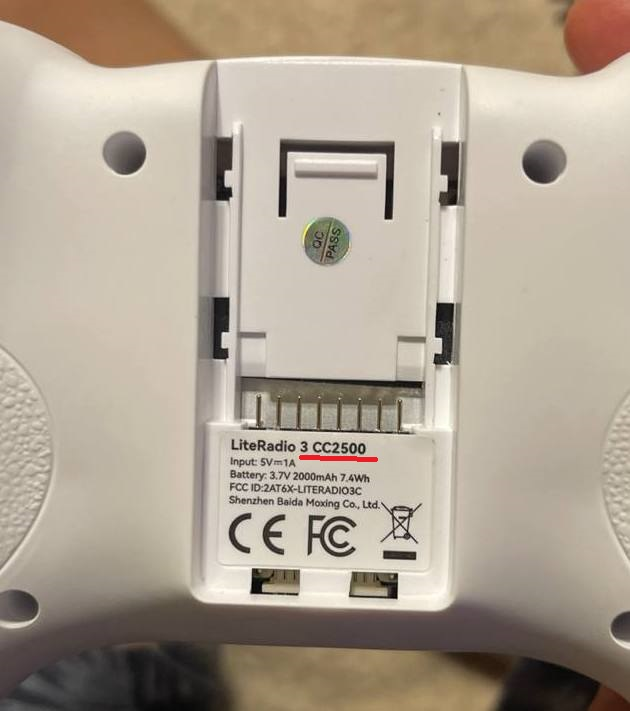

# BETAFPV LiteRadio 2, 2SE, 3

[LiteRadio 2 SE. Страница на сайте производителя](https://betafpv.com/collections/tx/products/literadio-2-se-radio-transmitter)  
[LiteRadio 3. Страница на сайте производителя](https://betafpv.com/collections/tx/products/literadio-3-radio-transmitter)   
[User Manual for LiteRadio 3](LiteRadio_3-User_Manual.pdf)  
[YouTube: BETAFPV Literadio 2 SE Joystick Calibration](https://www.youtube.com/watch?v=mkDREF-_yOk)  
[YouTube: LiteRadio ELRS does not work??? Flashing Firmware](https://www.youtube.com/watch?v=5UcZ9E8DDoE)

## Какая версия передатчика: ELRS или FrSky
На задней стороне снимаем крышку. Там будет наклейка.  
Так выглядит наклейка передатчика с FrSky `CC2500`:
  

## Подключение аппаратуры к компьютеру
!!! Чтобы использовать аппу в симуляторе, нужно подключать ее ВЫКЛЮЧЕННОМ виде.

### Аппа не не определяется компьютером 
1. Попробуйте поменять кабель. Бывает такое что с одним кабелем работает, а с другим нет.
2. Бывают проблемы с подключением аппы с ELRS 3 к компьютеру на процессоре AMD.

Проблему можно устранить, если перепрошить аппу на предыдущую версию ELRS 2:  
Подключаем аппу, переключив её в режим прошивки (зажав кнопку сетап и включение). Она в диспетчере устройств определяется COM портом.  
Запускаем BETAFPV Configurator и заливаем прошивку ELRS2 с официального сайта. 
После этого в симуляторах пульт стал определятся.  

**ВАЖНО**: дрон и аппа могут работать только на одной версии ELRS. На обеих должнобыть либо ELRS 2.X или 3.X.  
Таким образом, после даунгрейта прошивки в аппе, дрон перестанет биндится. Поэтому надо будет либо даунгрейтить дрон до ELRS 2 либо опять прошивать аппу до ELRS3.

Подробнее о проблеме и перепрошивке расказано в видео [Проблема с Betafpv Aquila. LiteRadio2se не работает с компом и симулятором](https://www.youtube.com/watch?v=1lq6xgl1Efk)

### Подключение аппаратуры к BETAFPV Configurator
Аппы от BETAFPV можно подключить к программе BETAFPV Configurator. Возможностей по настройке там крайне мало, но иногда это бывает нужно. Вот [скриншот экрана с настройками](RT_1_Setup.png).  
Скачать BETAFPV Configurator можно [здесь](https://github.com/BETAFPV/BETAFPV_Configurator/releases).  
На текущий момент есть две версии конфигуратора:  
[BETAFPV Configurator V1.1.1-RC1](https://github.com/BETAFPV/BETAFPV_Configurator/releases/tag/V1.1.1-RC1)  
[BETAFPV Configurator V2.0.0-RC2](https://github.com/BETAFPV/BETAFPV_Configurator/releases/tag/V2.0.0-RC2)  
Аппа на ELRS подключается к версии 2.0. Аппа на FrSky подключается **ТОЛЬКО** к версии 1.1.1.  
 - Скачиваем нужную программу и устанавливаем.
 - Подключаем аппу в ВЫКЛЮЧЕННОМ состоянии
 - Запускаем программу. Если аппа нормально определилась компом, в верхнем правом углу автоматически подставиться COM порт
 - Внизу посередине нажимаем оранжевую кнопку **Click to Active Configurator for Radio Transmitter**
 - Нажимаем кнопку **Connect RC** в правом верхнем углу. Если все хорошо, кнопка станет красной **Disconnect**, а экран отобразит настройки аппы. [Пример скриншота](RT_1_Setup.png)

## Проблемы со стиками
[Проблема с дрожанием стиков на потенциометрах][sticks_repair]  
[Ремонт BetaFPV LiteRadio 3 после падения](https://dzen.ru/a/Zaz-SmWVr2TlJhph)

### Проблема при большом значении газа LiteRadio 3
**Проблема:** дрон армится и пока на холостых все хорошо, когда пытаюсь взлететь он резко набирает обороты, сам на месте закручивается, переворачивается и выключает моторы.

**Причина:** когда увеличиваешь газ, провод между платой и левым стиком натягиваются до такой степени, что замыкаются соседние контакты. Помимо газа срабатывает еще и yaw. Это косяк сборки. При этом могут еще и провода оборваться и придется паять.

**Решение:** нужно разобрать аппу, снять стик, перевернуть его на 180 градусов и поставить назад. В настройках инвертировать газ и yaw.  После этого действия хода провода останется с запасом.  