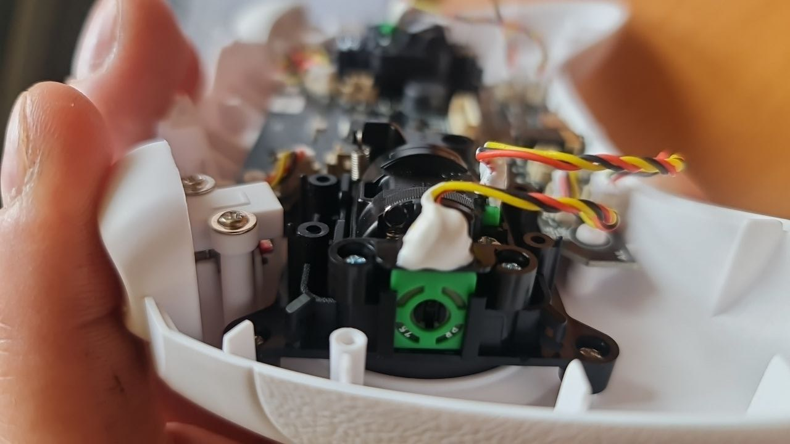

{#sticks_repair}
### Проблема
Через некоторое время с момента начала использования аппы, при плавном смещении стика или стиков, дрон начинает неадекватно прыгать. Если посмотреть на реакцию стиков в симуляторе или конфигураторе, видно что вместо плавного нарастания/уменьшения столбик резко прыгает.  

### Причина
Стики в аппах BETAFPV LiteRadio имеют потенциометры, то есть резисторы. Со временем они начинают изнашиваться, что приводит к проблеме.

###  Решение
Смазать потенциометры машинным маслом.   
Подробно можно посvотреть в видео [Betafpv Literadio 3 - ремонт дрожания дрона Cetus X FPV](https://www.youtube.com/watch?v=oJqVbjmjLWQ)

Разбираем аппу штатной отверткой. Капаем машинное масло в потенциометры (зеленого цвета на фото). Например шприцом. Весь процесс занимает около 15 минут.

ВРЕМЕННО проблема будет решена.  
На будущее лучше купить нормальную аппу на датчиках холла или поменять на аппе [стики на версию с датчиками Холла](10_Стики_на_датчиках_Холла.md). В продаже есть отдельно такие стики.

