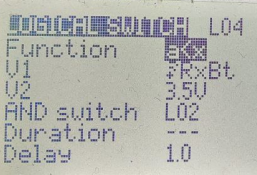
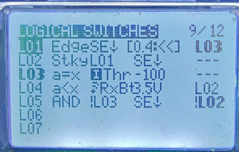
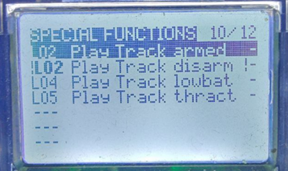

# Озвучивание на пульте низкого заряда батареи на дроне

## Простой вариант
1. Заходим в меню `MODEL`
2. Переходим на страницу `TELEMETRY (10 из 11)`, листаем сенсоры. Напряжение батареи - это `RxBt`. Легко проверить, если вытащить аккум - быстро пойдет вниз до .07в.
2. Переходим на страницу `LOGICAL SWITCHES (8 из 11)` - добавляем логически ключ L1 со значением `a<x`. Заходим в редактирование условия, подставляет перебором готовых переменных `RxBt < 3.5` (к примеру). Можно выставить задержку в 1 сек  
  
3. Переходим на страницу `SPECIAL FUNCTIONS (9 из 11)`, Создаем функцию и выбираем L01 (это наш логический ключ) - и действие: играть трек. Трек выбираем сами в соотв. поле, а-ля "low battery". Можно указать, через сколько секунд будет повторяться проигрывание трека.

Недостаток: голосовое уведомление будет срабатывать при подключении дрона к компьютеру.

## Вариант От Pavel Gavrilov https://t.me/reeson2003 
Будет голосовое сообщение о низком заряде батареи только если дрон заармлен.  
Заходим в меню `MODEL` и настраиваем логические переключатели и специальные функции, как на фото:  

  
 - `L03` срабатывает, когда Газ в нуле.  
 - `L01` срабатывает если зажат `SE`(мой `ARM`) больше 0.4сек и активен `L03`.  
 - `L02` Фиксирует состояние `L01` и включится Play Track `armed`.  
 - `L04` срабатывает через 1 сек если напряжение батки меньше 3.5В и активен `L02`. Включится Play Track `lowbat`  
  
Уточнение: чтобы в значении был значок напряжения батареи нужно выбрать telemetry и крутить вправо.  
 - `L05` срабатывает, если газ не в нуле и нажата `SE`(мой `ARM`) и неактивен `L02`. Включится Play Track `thract`

