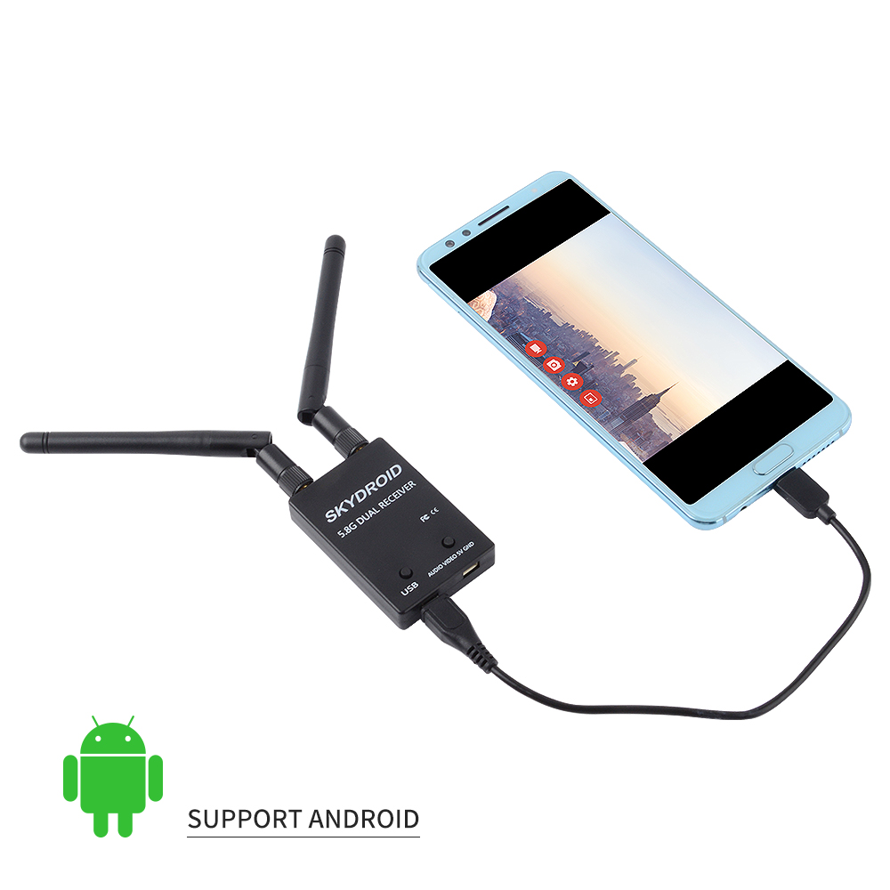

# Очки, шлемы и все что с ними связано

## Кратко про выбор аналоговых шлемов и очков
SKYZONE Cobra SD - дешево, годно, сердито.  
SKYZONE Cobra X - средне, оч годно и оч сердито, картинка огонь.  
SKYZONE Sky04x - топовые очки за топовые деньги.  

## Вывод картинки с дрона на экран смартфона или компьютера
[FPV Receiver 5.8g Skydroid 5.8Ghz 150CH True Diversity UVC OTG](https://vi.aliexpress.com/item/1005005930052108.html)   
  
[Обзор на YouTube](https://www.youtube.com/watch?v=1mjfU31WLts)

### Features:    
1.150CH 5.8Ghz analog signal, 1500 scans cover all bands.  
2.Resolution 640*480 30fps.  
3.Can display frequency spectrum, to check the signal strength of antenna or transmitter.  
4.Support dual display on smartphone, can be used as VR goggles.  
5.Please calibrate it in open area, and keep away from transmitter more than 30m. Long press the menu button and power on receiver, enter into calibration mode.  
 
### Descriptions:  
1.Support OTG cable connect to android smartphone or tablet.  
2.Single Antenna FPV receiver for Android Tablet PC Monitor.  

## Вывод картинки с компьютера на очки ev800dm
Чтобы вывести картинку с компа на очки ev800dm нужен [конвертер с HDMI выхода на на аналоговый тюльпан 3RCA](https://ozon.ru/t/WPXWpAw)
 
