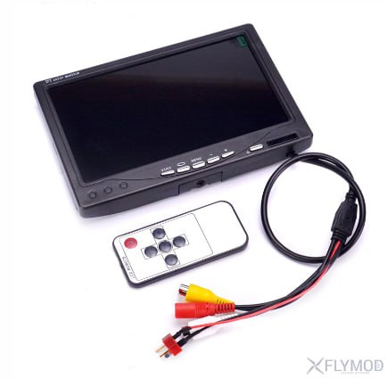
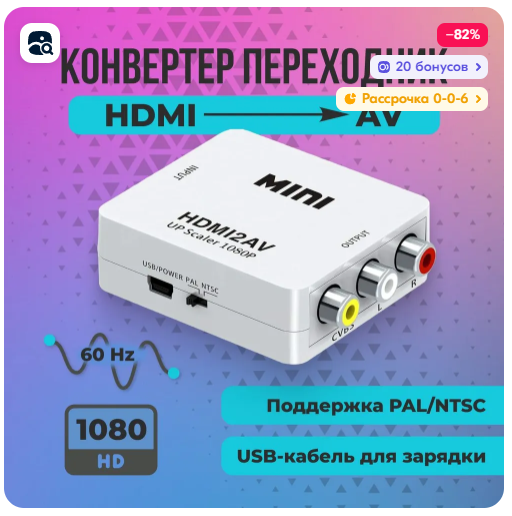

# Очки, шлемы и все что с ними связано

## Кратко про выбор аналоговых шлемов и очков
[SKYZONE](https://www.skyzonefpv.com/collections/goggles)  
Шлем SKYZONE Cobra SD - дешево, годно, сердито.  
Шлем SKYZONE Cobra X - средне, оч годно и оч сердито, картинка огонь.  
Очки SKYZONE SKY04O PRO - стартовые очки   
Очки SKYZONE Sky04x - топовые очки за топовые деньги.  

## Цифровые шлемы

[Цифра для FPV: ЧТО ВЫБРАТЬ? DJI vs Walksnail. YouTube: DRONOFLY FPV](https://www.youtube.com/watch?v=Oeufcub_bmo)

### Walksnail 
Walksnail Avatar HD goggles  
Walksnail Avatar HD Goggles X  
Walksnail Avatar HD Goggles L  
ну и нашлепка на шлемы по типу кобры и очки по типу скайзон Walksnail Avatar VRX

### DJI

### Caddx

### HDZero
[HDZero Goggle](https://www.hd-zero.com/product-page/hdzero-goggle)

## Вывод картинки с дрона на экран смартфона или компьютера
Дрон отдает аналоговый сигнал. Его принимает шлем и показывает.  
Соответственно его можно принимать и выводить каким-нибудь другим приемником и куда-нибудь записывать. 
Есть такие устройства. Например, экраны с приемником.Или приемник с преобразователем и кабелем, отдающий сигнал, например в телефон или компьютер.

[FPV Receiver 5.8g Skydroid 5.8Ghz 150CH True Diversity UVC OTG](https://vi.aliexpress.com/item/1005005930052108.html)   
  
[Обзор на YouTube](https://www.youtube.com/watch?v=1mjfU31WLts)

### Features:    
1.150CH 5.8Ghz analog signal, 1500 scans cover all bands.  
2.Resolution 640*480 30fps.  
3.Can display frequency spectrum, to check the signal strength of antenna or transmitter.  
4.Support dual display on smartphone, can be used as VR goggles.  
5.Please calibrate it in open area, and keep away from transmitter more than 30m. Long press the menu button and power on receiver, enter into calibration mode.  
 
### Descriptions:  
1.Support OTG cable connect to android smartphone or tablet.  
2.Single Antenna FPV receiver for Android Tablet PC Monitor.  

### Еще вариант: 

## Вывод картинки с компьютера на очки ev800dm
Чтобы вывести картинку с компа на очки ev800dm нужен [конвертер с HDMI выхода на на аналоговый тюльпан 3RCA](https://ozon.ru/t/WPXWpAw)
 
