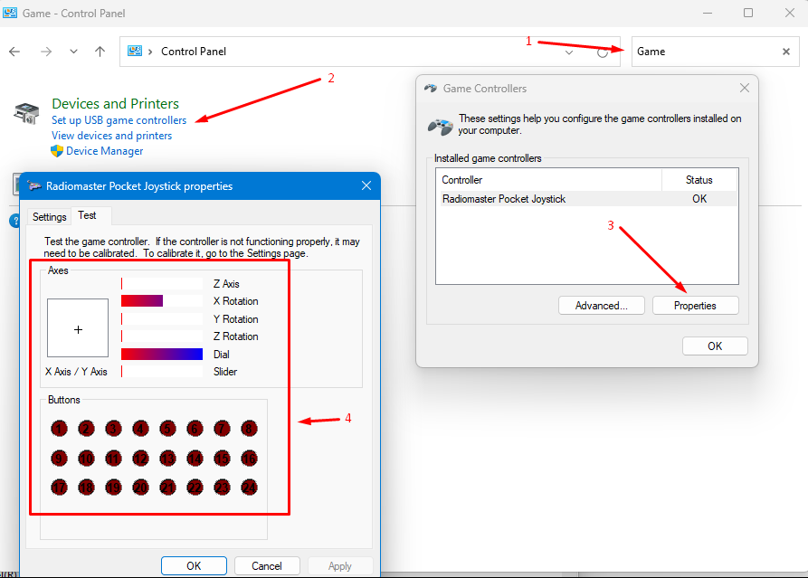
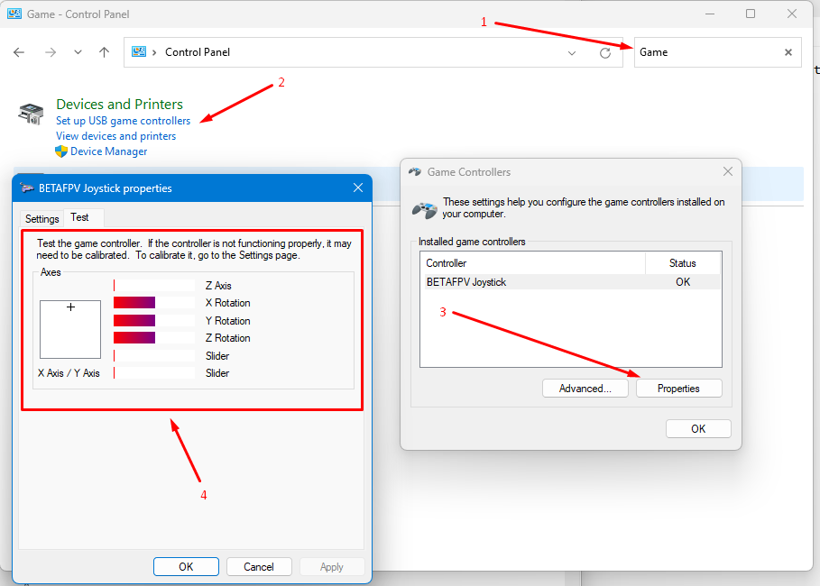

# Подключение аппаратуры к симулятору

**ВАЖНО**: В 99% случаев успешность определения пульта симулятором зависит от успешного определения пульта самой операционной системой. 

При подключении пульта кабелем к компьютеру нужно учитывать следующие особенности:  
 - Аппаратура BRETAFPV LiteRadio 2 и 3 должна подключаться в **выключенном** виде.  
 - Аппаратура на базе прошивки EdgeTX подключается во включенном виде. При этом на экране появляется меню, в котором нужно выбрать пункт `USB Joystick (HID)`.
 
## Подключение пульта кабелем `USB Type-C` к компьютеру с ОС `Windows`
При подключении Windows издает характерный звук. К сожалению это не значит, что пульт УСПЕШНО подключен. Чтобы проверить, нужно найти пульт a USB игровых устройствах:  
1. Открыть `Панель управления (Control Panel)`  
2. Справа вверху в поле поиска ввести слово `game`.  
3. В окне в разделе `Devices and Printers` появится строка `Set up USB game controllers`. Нужно щелкнуть по ней мышкой.  
 
Вместо пунктов 1-3 можно в командной строке выполнить:
```
C:\WINDOWS\system32\joy.cpl
```
 
В результате откроется окно Game Controllers. 
 
Если в списке есть ваш пульт, можно нажать кнопку `Properties` и увидеть в окне все кнопки, переключатели и стики пульта. Можно подвигать на пульте стики, понажимать кнопки и убедиться, что все каналы работают. 
 
Вот так это выглядит для аппаратуры Radiomaster Pocket:  

 
Вот так это выглядит для аппаратуры BETAFPV Literadio 3:  


С этого момента можно считать, что пульт подключился к операционной системе **успешно** и будет корректно работать в симуляторе **после его калибровки**. 

В качестве дополнительной рекомендации можно выключить на пульте передатчик (если есть такая возможность). Это уменьшит расход батареи пульта и нагрев передатчика. А поскольку на некоторых пультах есть вентилятор, то он не будет включаться и шуметь.

------------------
Если в списке **пусто** - значит пульт определился **некорректно**.  
Можно открыть `Диспетчер Устройств (Device Manager)` и проверить, нет ли там неизвестных устройств с восклицательным знаком. 

Возможные причины и действия:  
1. Попробуйте поменять кабель. Бывает такое что с одним кабелем работает, а с другим нет.  
2. Бывают проблемы с подключением пульта BERTAFPV LiteRadio с передатчиком **ELRS версии 3.х** к компьютеру на процессоре **AMD**. Подробнее об этом можно прочитать в [статье по самому пульту](./../10_Аппаратура(Пульты)/90_Модели/30_Betafpv/LiteRadio/01_Общая_информация.md)
 
## Проблема запуска Liftoff при подключение к компьютеру с `MacOS`
Jткрываем терминал и переходим в каталог с запускаемым файлом, у меня игра лежит в Applications(Приложения)  
```
cd /Applications/Liftoff.app/Contents/MacOS
```
Делаем файл запускаемым:
```
sudo chmod +x Liftoff
```
 
 
