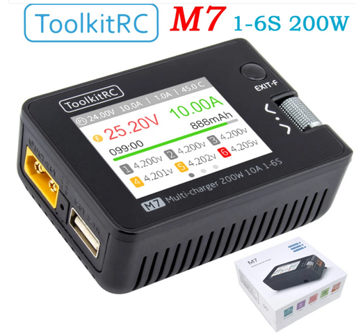
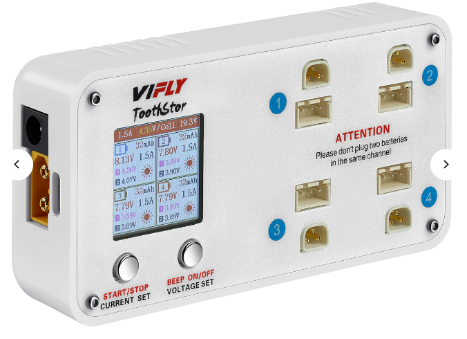

# Зарядные устройства

## Для аккумуляторов 1S с коннектором BT2.0 или PH2.0

### VIFLY WhoopStor v3
[На сайте производителя](https://viflydrone.com/products/vifly-whoopstor-6-ports-1s-battery-storage-charger-discharger?ref=i22jgskz)  
[На AliExpress.com](https://aliexpress.com/item/1005003791098261.html)

Одновременная зарядка шести 1S батарей зарядка с коннекторами BT2.0 или PH2.0. Позволяет:
- заряжать LiPO 4.20V / LiHV 4.35V
- Переводить в режим Storage  3.80V / 3.85V

  

### VIFLY WhoopStor v2
Имеет те же функции, но немного другой внешний вид. Снята с продажи.

[Обзор от Petrokey](https://www.youtube.com/watch?v=AE0Ll6I_feg)

## Для аккумуляторов 1-4S с коннектором XT30 или XT60

### ToolkitRC Q4AC 
[На сайте производителя](https://www.toolkitrc.com/q4ac)  
[На AliExpress.com](https://aliexpress.com/item/1005006086423161.html)

Одновременная зарядка **четырех** 1-4S батарей зарядка с коннектором XT60.  
Позволяет:
- заряжать LiPO 4.20V / LiHV 4.35V на ячейку
- Переводить в режим Storage  3.80V / 3.85V на ячейку

Имеется **встроенный** блок питания

  
  

Для заряда батарей с коннектором XT30 нужен переходник Female XT60 - Male XT30

## Для аккумуляторов 1-6S с коннектором XT30 или XT60

### ToolkitRC M6D 
[На сайте производителя](https://www.toolkitrc.com/m6d)  
[На AliExpress.com](https://vi.aliexpress.com/item/1005006649168930.html)  
[На Ozon.ru](https://www.ozon.ru/product/toolkitrc-m6d-500w-15a-dvuhkanalnoe-intellektualnoe-zaryadnoe-ustroystvo-mini-dlya-batarey-lipo-1-6s-1470849116/)

Одновременная зарядка **двух** 1-6S батарей с коннектором XT60. Позволяет:
- заряжать LiPO 4.20V / LiHV 4.35V на ячейку
- Переводить в режим Storage  3.80V / 3.85V на ячейку

  

Для заряда батарей с коннектором XT30 нужен переходник Female XT60 - Male XT30

### ToolkitRC M7 
[На сайте производителя](https://toolkitrc.com/m7)  
Одновременная зарядка **одной** 1-6S батареи с коннектором XT60. Позволяет:
- заряжать LiPO 4.20V / LiHV 4.35V на ячейку
- Переводить в режим Storage  3.80V / 3.85V на ячейку

  

## Для аккумуляторов 2S с коннектором BT3.0
### VIFLY ToothStor - 4 Port 2S
[На сайте производителя](https://viflydrone.com/products/vifly-toothstor-4-port-2s-balance-charger-with-storage-mode?variant=48130105606440)
  
Также через него можно заряжать 2S аккумуляторы с балансировочным проводом XH2.54 (см. фото на сайте)

## Альтернативное решение для XT30 XT60 2-6S
1. Любая однопортовая зарядку 2-6S
2. Плата параллельной зарядки (Charger Board) или "Multi 6 In 1 2S-6S Lipo Battery Parallel Charging Board With EC3/EC5/XT30/XT60/XT90/Tplug"  
Например:  
[VIFLY Whoop Series Board Balance Charging Board 6 Port 1S](https://aliexpress.com/item/1005007307774844.html)    

[Power-Genius 2 IN 1 PG Parallel Charging Board XT30 XT60](https://aliexpress.com/item/4000404668773.html)
  
[На AliExpress.ru](https://aliexpress.ru/item/4000946028794.html?sku_id=10000011449062681)  
[На AliExpress.com](https://aliexpress.com/item/4000946028794.html?sku_id=10000011449062681)

## IMax B6
Прототип всех современных зарядок. Всего один зарядный порт
  
[На AliExpress.com](https://vi.aliexpress.com/item/4000961827544.html)