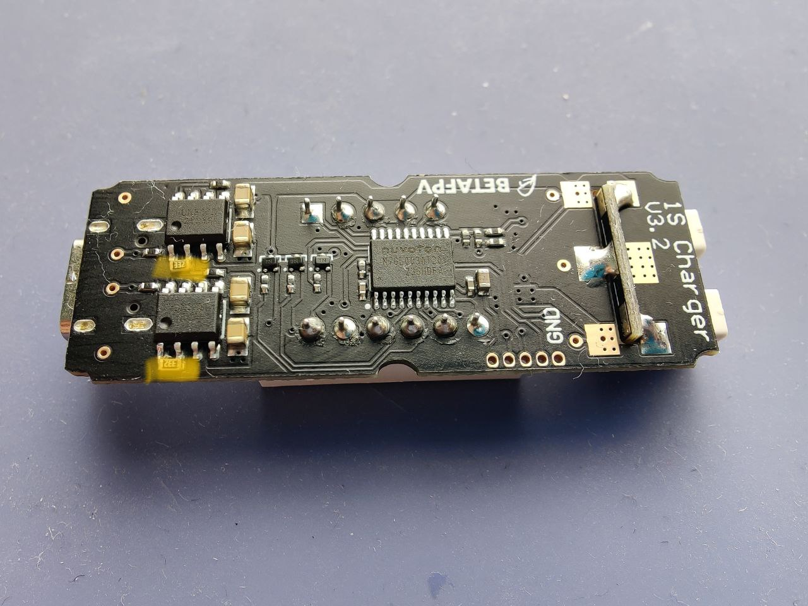

# Исправление зарядного устройства BetaFPV

С завода выставлен ток в 1а что пагубно влияет на долговечность аккумуляторов

Чтобы штатная зарядка цетусов/метеоров не убивала ваши батки током 1А, нужно заменить эти два резистора. Если поставить 2.4кОм, ток будет 500мА. Я поставил 3.3кОм, у меня ток 370мА - достаточно для зарядки GNB 380mah.

By Pavel Gavrilov