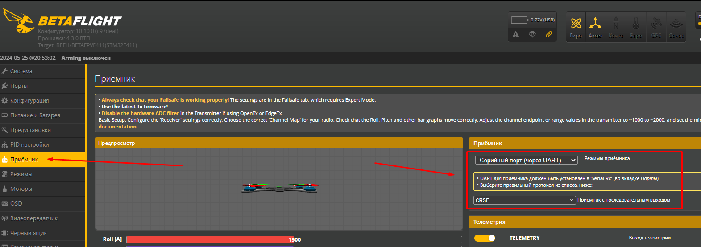

# Bind апаратуры и дрона в системе ELRS

## Общая информация
Работа по протоколу Express LRS позволяет связывать дрон и аппаратуру двумя способами: Bind по кнопке и через Bind фразу.  
Обязательным предусловием является то что на дроне и аппаратуре должно быть одинаковый протокол (ELRS), одинаковой версии (2.х.х или 3.х.х), одинаковая частота (2.4ГГц или 915 мГц)  
Если версии не совпадают, значит надо апгрейдить или передатчик на аппаратуре до версии на приемнике дрона, или приемник дрона до версии на передатчике аппаратуры.  
Процесс апгрейда выходит за рамки этой статьи.
 
### 1. Bind по кнопке.  
 - Переводим дрон в режим Bind. Способ входа в этот режим может отличаться от способа подключения приемника к полетному контроллеру (см. ниже).  
 - Выполняем операцию Bind на аппаратуре. Способ  выполнения зависит от аппаратуры (см. ниже).  
 
Недостаток такого способа в том, что таким образом можно связать одну аппаратуру только с одним дроном. Последующая перепривязка разрывает прошлую связь.

### 2. Указание Bind фразы.  
В ELRS модуль и аппаратур(ы) и дрона или дронов указывается одно и тоже ключевое слово (Bind фраза). И тогда все аппаратуры и дроны с этим словом могут работать без перепривязки.  

## Bind дрона
ELRS приемник может быть подключен к полетному контроллеру двумя способами: через **UART** порт или **SPI**. От этого зависит, каким образом биндить дрон.  
Проверить способ подключения можно подключив дрон к Betaflight. 

### Приемник подключен по UART
На вкладке Порты на одном из портов включен `Serial Rx ` 
  
На вкладке Приемник в панели Приемник указан `Серийный порт (через UART)` и протокол `CRSF` (CrossFire)
  

#### Перевод дрона в режим Bind
Нужно подать на дрон (приемник) питание три раза с паузой около полусекунды. То есть подсоединить батарею, отсоединить, опять соединить, опять подсоединить, третий раз подсоединить батарею окончательно.  
Когда питание подано в третий раз, следите за тем, чтобы светодиод начал мигать дважды - это признак того, что приемник перешел в режим привязки.

#### Ввод Bind фразы
!!!! Приведенная операция занимает время, поэтому нужно позаботиться, чтобы **не спалить видеопередатчик**.  
Можно включить вентилятор и направить его на дрон, сделав обдув.  
Еще можно перевести видеопередатчик в `PIT mode` в BetaFlight:  
 - Подключаем дрон. 
 - Заходим в раздел Видеопередатчик. 
 - В выпадающем списке мощности вместо значения мощности выбираем `PIT`. 
 - Нажимаем `Сохранить`.

Теперь сам процесс:  
 - Подключаем к дрону батарею или USB кабелем к компьютеру.
 - Ждем минуту, и светодиод на приемнике начинает мелко моргать. Это он перешел в режим WiFi.  
 - Ищем  WiFi сеть с именем  `ExpressLRS RX` и коннектимся с паролем `expresslrs`  
 - Идем браузером по адресу http://10.0.0.1
 - Вводим значение в поле `Binding Phrase`
 - Нажимаем `Save`

[Видео процесса на примере Meteor65pro](Rx_SetBindPhraseOverWiFi.mp4)
 
### Приемник подключен по SPI
На вкладке Порты ни на одном из портов НЕ включен `Serial Rx`  
  
На вкладке Приемник в панели Приемник указан `SPI Rx` и ниже `EXPRESSLRS ` 
  

#### Перевод дрона в режим Bind
Можно использовать один из вариантов:
 - В Betafligh на вкладке Приемсник внизу нажать кнопку `Привязать приемник`  
  
 - тонким предметом нажать кнопку на полетнике (см. инструкцию к полетнику или приемнику)

Еще варианты [указаны в этой статье](https://support.betafpv.com/hc/en-us/articles/4403742839705-How-to-Bind-with-F4-Betaflight-FC-SPI-ExpressLRS-Receiver).

Если дрон перешел в режим Bind, светодиод на приемнике (полетнике) будет быстро мигать.  

#### Ввод Bind фразы
В Betaflight Configurator идем на вкладку Приемник и вводим Bind фразу в поле `Binding фраза`  
  

## Bind аппаратуры
### [Аппаратура на EdgeTX на примере RadioMaster Pocket](10_Аппаратура(Пульты)/90_Модели/10_Radiomaster/01_Pocket/10_Bind.md)  
### BETAFPV LiteRadio (???)

## Полезные видео на тему Bind
[Radiomaster Pocket - обзор, разбор, пейр. YouTube: Petrokey](https://www.youtube.com/watch?v=xYzz5JtX9GE)

[ExpressLRS - соединить Betafpv Cetus, LiteRadio3 RadioMaster tx16s. версии, совместимость, настройка. YouTube: Petrokey](https://www.youtube.com/watch?v=cM5g9BC9sQY)

[Betafpv Cetus X пэйр пульта бинд кнопкой. YouTube: Petrokey](https://www.youtube.com/watch?v=CByA9YKPEJI)

[Я забыл BIND-фразу ELRS! Что делать? YouTube: 
ZhukoRama FPVlog (ZRFPV)](https://www.youtube.com/watch?v=c6mdZVzCn58)

[Как привязать пульт к квадрокоптеру BETAFPV. YouTube: Змей Горыныч](https://www.youtube.com/watch?v=fwcmUY4qMXs)

[Як це все підключити? З'єднуємо пульт та FPV дрон і налаштовуємо відеозв'язок. ELRS і Crossfire. (укр.). YouTube: Є-Дрон](https://www.youtube.com/watch?v=US8rYxZ1YHw)

[BETAFPV Meteor 65 Pro ELRS - How To Set Up and Bind (SPI Version). YouTube: Volaertus](https://www.youtube.com/watch?v=T3NA_eTy63k)