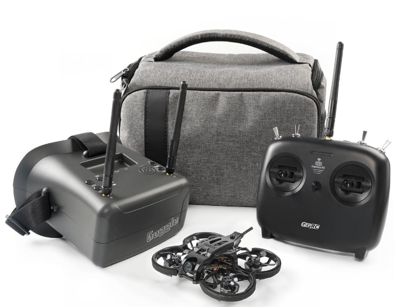
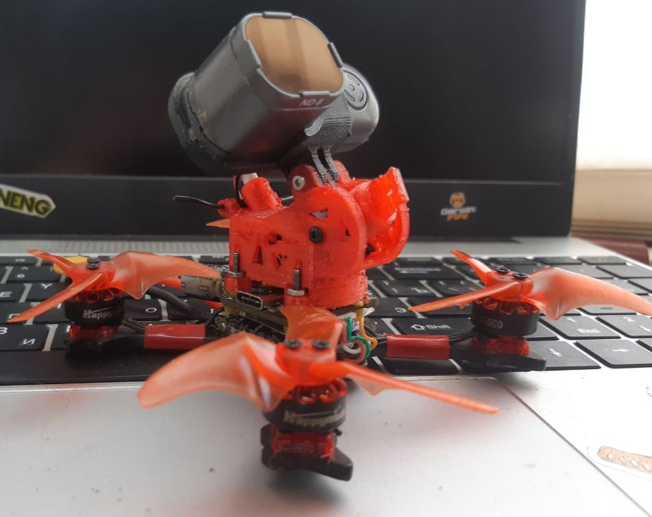

# Тема постоянных споров: с чего начинать новичку, что купить или собрать

## Мнение №1
Поэтому берешь:  
 - аппаратуру **Radiomaster Pocket ELRS FCC** версию,  
 - шлем можно и **BETAFPV VR03** взять как самый дешёвый, но можно и **ev800dm**, либо **Skyzone cobra** (тут по бюджету).  
 - дрон на аналоге(в описании написано, да и как правило большинство недорогих дронов на нем), с протоколом связи ELRS,  
 - батарейки смотри по дрону, его разъёмам и фото этих разъемов(может быть например 2s на одном разъёме а30-это надо брать 2s аккум с этим разьемом, может и на двух по 1s, например как на цетусе 2s на bt2 разьеме-подключаются две 1s батарейки.  
 
 Ну и по дронам нужно понимать, где летать собрался:  
 Если на улице - от двух дюймов и выше бери. Можешь **HGLRC Draknight**  взять (сам дрон, но не RTF набор).  
 Для дома **BETAFPV Meteor65** или **BETAFPV Meteor75**. Можно **Happymodel  Mobula 6** или **Happymodel Mobula 7**.
 
В общей сложности, дешевле выходит собирать комплект, чем сразу брать готовый набор. А учитывая, что все в наборе придется менять или улучшать ставя недешевые плюшки - лучше реально сначала разобраться и собрать, чем потом карманы выскребать.

## Мнение пользователя @V8787
Пульт (аппаратура) общается с дроном на протоколе ELRS 2,4ГГц (или 915, или 868, или кроссфаер, или вообще не дай бог frsky).  
Нужно определиться со стандартом и под него все собирать.

Если ты сейчас соберешь комплект на ELRS 2,4 - ты сможешь к нему подцепить любое устройство поддерживающее данный формат связи.

ELRS 2.4 - это популярный и распространенный формат связи для любительского дрона.
Под него много железа и всегда можно что то купить, как новое так и б/у.

Что касается аналогового видео - оно вещает на частоте 5.8 ГГц.   
Поэтому для аналоговой видеосистемы подходит абсолютно любой шлем или очки, способные принимать картинку на частотах от 5.6 до 5.9 ГГц (там 40 каналов)

Ты можешь придти где летают другие люди, включить шлем, просканировать эфир и поймать чей то сигнал, посмотреть как они летают.
Это как телевизор.

Поэтому шлем не нужно как-то биндить, привязывать, коннектить… просто включай и смотри.

А если ты захочешь дрон с цифровой видеосистемой - тут сложнее. Под каждую видеосистему свои очки. Есть не то чтобы универсальные, но те которые подходят к разным видеосистемам. А есть такие, которые работали только со своим железом и все. Поэтому когда для себя решишь «хочу цифру» - нужно решить какую, и какие очки под нее покупать отдельно.

## Ready To Fly kit (RTF) наборы
**СПОЙЛЕР**: Все **RTF** комплекты плохого качества.  

[Cetus X FPV Kit](https://betafpv.com/collections/all-drone/products/cetus-x-fpv-kit)    
/01_Модели/Betafpv/10_Cetus_X/CetusXFpvKit.png)   
Почитать [можно здесь](./00_Дроны(Квадрокоптеры)/01_Модели/Betafpv/10_Cetus_X/10_Общее.md)

[GEPRC TinyGO 4K FPV Whoop RTF](https://geprc.com/product/geprc-tinygo-4k-fpv-whoop-rtf/)  

[Sub250 Whoopfly16 RTF Combo](https://sub250.com/collections/new-arrival/products/whoopfly16-rtf-combo)

## Готовые дроны

### Для помещений (с дактами)
[BETAFPV Meteor65 Pro](./00_Дроны(Квадрокоптеры)/01_Модели/Betafpv/Meteor65_Pro.md)  
[BETAFPV Meteor Air65](./00_Дроны(Квадрокоптеры)/01_Модели/Betafpv/Meteor_Air65.md)  
[BETAFPV Meteor75 Pro](./00_Дроны(Квадрокоптеры)/01_Модели/Betafpv/Meteor75_Pro.md)  
[Happymodel Mobeetle6](./00_Дроны(Квадрокоптеры)/01_Модели/Happymodel/Mobeetle6.md)  

### Для улицы
[BETAFPV Meteor85 (2022) (с дактами)](./00_Дроны(Квадрокоптеры)/01_Модели/Betafpv/Meteor85.md)  
[HGLRC Draknight 2-inch toothpick (без дактов)](./00_Дроны(Квадрокоптеры)/01_Модели/HGLRC/Draknight_2-inch.md)  
[Darwin Baby Ape Pro V2 FPV Drone 3-inch (без дактов)](./00_Дроны(Квадрокоптеры)/01_Модели/DarwinFPV/BabyApe_Pro_V2.md)

## Самосбор

### Для помещений

#### На базе Happymodel Mobula 6 
- Дрон Mobula 6 2024 V2.0  
- Полетный контролер SuperX V2.0  
- Рама Mobula 6 2024 (черная)    
- Подшипниковые моторы 0702 VCI 25 | 27 | 29 k kv ( комплект 4 мотора)  
- Аккумулятор 1s DOGCOM 320    

#### На базе Meteor air65 
- Рама BETAFPV 65 air  
- Canopy BETAFPV meteor    
- Полетный контроллер BETAFPV f4 aio  
- VTX BETAFPV m03   
- Камера C02 BetaFpv    
- Моторы vci 0802 25000 kv   

### Для улицы

#### На базе BETAFPV Meteor85
- [Рама от BETAFPV Meteor 85](https://betafpv.com/products/meteor85-brushless-whoop-frame?variant=40024037654662)  
- [Моторы BETAFPV 1103 11000KV-2S](https://betafpv.com/collections/motors/products/1103-brushless-motors?variant=14762596007980)  
- [Полетный контроллер BETAFPV F4 1S 12A AIO SPI ELRS 2.4G](https://betafpv.com/products/f4-1s-12a-flight-controller)  
- [Камера Caddx Ratel 2 Baby](https://caddxfpv.com/products/caddxfpv-baby-ratel2-analog-camera)  
- [Видеопередатчик RUSH TINY TANK Nano VTX](https://rushfpv.net/products/tank-tiny-vtx)  
- [Пропеллеры Gemfan 2015 2-Blade Propellers 4PCS (1.5mm Shaft)](https://betafpv.com/products/gemfan-2015-2-blade-propellers-4pcs-1-5mm-shaft)  
- [Батарея LAVA 2S3S4S 450mAh 75C](https://betafpv.com/products/lava-2s-3s-4s-450mah-75c-battery-2pcs)  

#### 2,5" чертолет от @Тимура
- Speedybee f405 mini(лучше aio взять, этот полетник вообще запаска для трешки и с этой рамой не очень совместим)  
- Моторы happymodel 1204 5000kv  
- VTX hglrc zeus nano  
- Курсовая камера caddx baby rattle 2  
- Пишущая камера runcam thumb pro w  
- Пропеллеры emax avan 2,5"(есть и на 2") или gemfan 2540   
- Антенна rush cherry 2  
- Приемник ELRS 2,4 jhemcu rx24t  
- Рама eyas 100  
- Кастомные подкладки под моторы, дабы их поднять над стаком  
- Кастомная канопа 20х20, ибо с таким стаком туда вообще ничего другого либо не лезет  

#### 2,5" дрон от @Соуп МакТаVиш
AIO - Argus f722 aio 40a with shell  
Motor - 1203 6500kv любые   
Frame - Sologood Apex 2  
VTX - Caddx Vista Nebula Pro Nano   
RX - Radiomaster RP1  
Пропы хз 
