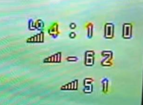

# Что такое LQ и RSSI

Краткое объяснение  
  

Верхняя строчка: `LQ` - качество сигнала. Насколько четко дрон слышит аппу.  
Чуть ниже: `RSSI` - Мощность (громкость) сигнала. Нужно следить чтобы RSSI не опускался ниже -100.  
Самая нижняя: шкала RSSI в попугаях. Можно выключить. Не информативно.

- Ты слушаешь человека, находящегося с тобой в одной комнате. В комнате тихо. LQ = 100, RSSI - 25.  
- Включается перфоратор. Тебе говорят на той же громкости, но ты не слышишь... RSSI тот же, а LQ упал в ноль....
- Человек, которого ты слушаешь, уходит в другую комнату. Его голос становится тише. Значение RSSI увеличивается в отрицательную сторону.

[Объяснение LQ и RSSI для ExpressLRS и Crossfire(перевод)](https://artline.ua/blogs/obyasnenie-lq-i-rssi-dlya-expresslrs-i-crossfire)   
На случай, если не откроется [та же статья в виде PDF файла](Объяснение_LQ_и_RSSI.pdf)

[LQ and RSSI Explained for ExpressLRS and Crossfire Radio Links](https://oscarliang.com/lq-rssi/)

[Signal Health](https://www.expresslrs.org/info/signal-health/)